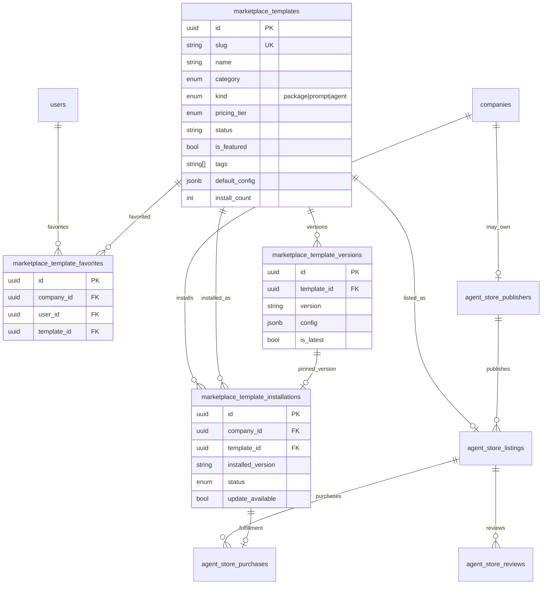

# THTWAAT Marketplace — Phase 1 Architecture

> **Decision:** Extend existing `app/marketplace` (install engine) + `app/agent_store` (commerce/discovery).  
> Do **not** create a third catalog or install path.

## Product split

| Layer | Module | Responsibility |
|-------|--------|----------------|
| Install engine | `marketplace` | Registry, versions, company installs, update/rollback |
| Storefront / monetization | `agent_store` | Publishers, listings, reviews, paid install, moderation |
| SaaS UI | `apps/templates/saas` `/app/templates` | Browse / Installed / Updates (marketplace APIs today) |

Phase 4 “100 templates” (Writing, Coding, …) are **catalog rows** in `marketplace_templates` with `kind=prompt|agent|package`. Prompt body lives in `default_config` / version `config` JSONB (typed fields below).

## ER diagram



## `default_config` contract (prompt / agent kinds)

```json
{
  "prompt": "You are a …",
  "variables": [{"name": "topic", "label": "Topic", "required": true}],
  "temperature": 0.7,
  "example_input": "…",
  "example_output": "…",
  "model_hint": "gpt-4o-mini"
}
```

Package kinds keep existing keys (`branding`, `routes`, `features`, …) via `package_path`.

## Permissions (existing RBAC)

| Permission | Roles | Operations |
|------------|-------|------------|
| `templates:read` | owner, admin, manager, developer, employee, viewer | Browse, detail, categories, installed, updates, favorites read |
| `templates:manage` | owner, admin, developer | Install, update, rollback, uninstall, favorite write, registry CRUD |
| `platform:admin` | super_admin (+ enterprise admin routes) | Agent-store moderation, force publish/unpublish |

Source: `app/rbac/enums.py`, `app/rbac/policy.py`.

## API contracts (Phase 2 mapping — already live unless noted)

Phase brief routes → **canonical production paths** (do not duplicate):

| Phase brief | Canonical | Auth |
|-------------|-----------|------|
| `GET /templates` | `GET /api/v1/marketplace/templates` | `templates:read` |
| `GET /templates/{id}` | `GET /api/v1/marketplace/templates/{id_or_slug}` | `templates:read` |
| `POST /templates` | `POST /api/v1/marketplace/templates` | `templates:manage` |
| `PUT /templates/{id}` | `PATCH /api/v1/marketplace/templates/{id}` | `templates:manage` |
| `DELETE /templates/{id}` | archive via `PATCH` `status=archived` (soft) | `templates:manage` |
| `POST /templates/install` | `POST /api/v1/marketplace/templates/{slug}/install` | `templates:manage` |
| `POST /templates/uninstall` | `DELETE /api/v1/marketplace/installations/{id}` | `templates:manage` |
| `POST /templates/update` | `POST /api/v1/marketplace/installations/{id}/update` | `templates:manage` |

**Phase 1 additions:**

| Method | Path | Notes |
|--------|------|-------|
| `GET` | `/api/v1/marketplace/favorites` | company+user favorites |
| `POST` | `/api/v1/marketplace/templates/{id_or_slug}/favorite` | idempotent add |
| `DELETE` | `/api/v1/marketplace/templates/{id_or_slug}/favorite` | remove |

Query filters (browse): existing `q`, `category`, `featured` + **Phase 1** `kind`, `pricing_tier`.

Agent-store storefront remains under `/api/v1/agent-store/*` for ratings/paid/trending (Phases 7–9).

## Phase 2 (CRUD harden) — done

| Brief | Canonical |
|-------|-----------|
| GET list (paginated) | `GET /marketplace/templates` → `{items,total,limit,offset,sort}` |
| GET one | `GET /marketplace/templates/{id_or_slug}` |
| POST create | `POST /marketplace/templates` |
| PUT/PATCH update | `PUT\|PATCH /marketplace/templates/{id}` |
| DELETE | `DELETE /marketplace/templates/{id}` (archive) |
| install | `POST /marketplace/templates/{slug}/install` |
| update install | `POST /marketplace/templates/update` **or** `.../installations/{id}/update` |
| uninstall | `POST /marketplace/templates/uninstall` **or** `DELETE .../installations/{id}` |

Query: `q`, `category`, `featured`, `kind`, `pricing_tier`, `sort`, `limit`, `offset`, `newest`.

## Phase roadmap (reuse)

| Phase | Work |
|-------|------|
| 1 | Schema gaps + favorites + architecture |
| 2 | Paginated CRUD + PUT/DELETE + install aliases + tests |
## Phase 3 (SaaS UI) — done

Route: `/app/templates` (nav label Marketplace).

Tabs: Browse · Featured · Favorites · Installed · Updates  
+ search, category chips, kind filter, template detail dialog, install/update confirm dialogs.  
Client: `marketplaceApi.listPage`, `favorites`, `favorite`, `unfavorite`.
## Phase 4 (prompt seeds) — done

100 production prompt/agent templates as JSON:

- `data/marketplace/seeds/index.json`
- `data/marketplace/seeds/prompts/*.json`
- Regenerator: `python scripts/generate_marketplace_prompt_seeds.py`

Each file includes UUID, slug, category, kind, prompt, variables, temperature, tags,
visibility, featured, version, example I/O, pricing_tier.

## Phase 5 (SQL / CLI seed) — done

Idempotent install + upgrade + rollback:

- Python loader: `app/marketplace/seed_loader.py`
- Catalog entry: `seed_marketplace_catalog()` / CLI `python -m scripts.seed_marketplace`
- Flags: `--prompts-only`, `--packages-only`, `--dry-run`, `--no-upgrade`, `--no-refresh`, `-v`
- SQL (generated): `data/marketplace/sql/001_seed_prompt_templates.sql`
- Upgrade SQL: `data/marketplace/sql/002_upgrade_prompt_templates.sql`
- Rollback: `data/marketplace/sql/900_rollback_prompt_seeds.sql`
- Regenerate SQL: `python scripts/generate_marketplace_seed_sql.py`

Prompt payloads land in `default_config` / version `config` JSONB.
Stable UUIDs from JSON are preserved on first insert (slug unique conflict → upsert).

## Phase 6 (Admin UI) — done

SaaS route: `/app/admin` (nav: Admin, role-gated).

Tabs:
- **Registry** (`templates:manage`) — list draft/published/archived, create, publish, feature, archive, add version
- **Agent Store** (`platform:admin` / `super_admin`) — stats, pending moderation, abuse resolve

API:
- `GET /marketplace/admin/templates?status=all|draft|published|archived`
- Existing registry CRUD + agent-store `/admin/*` moderation endpoints
- FE clients: `marketplaceApi.adminList|createTemplate|…`, `agentStoreApi.*`

| 7 | Postgres FTS on name/description/tags |
| 8 | Versioning UI + release notes |
| 9 | Analytics |
| 10 | Audit / docs / deploy |

## Design decisions

1. **Single install engine** — `MarketplaceService` only (enforced by agent_store tests).
2. **Categories** — extend PG enum `template_category_enum` rather than free-string (keeps filters typed).
3. **Prompt payloads** — JSONB `default_config` / version `config` avoids wide sparse columns.
4. **Favorites** — tenant + user scoped; not global likes.
5. **Soft delete** — `status=archived`; hard DELETE avoided to protect install FKs.
