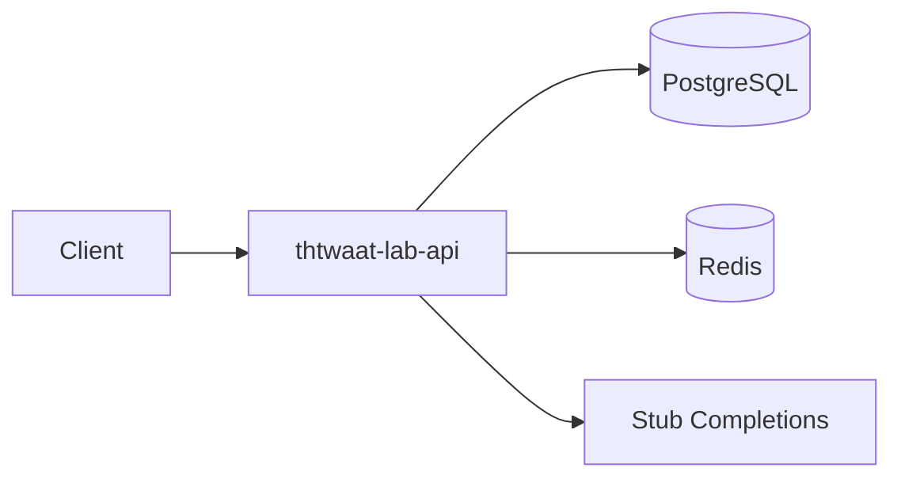

# Semester 01 — Systems Foundations for Platform Engineers

**Duration:** 20 weeks  
**Outcome:** You can design, containerize, observe (minimally), and ship a small production-shaped API service with CI — the substrate every AI platform sits on.  
**Semester project:** **Hello Platform** — `thtwaat-lab-api`  
**Maps to THTWAAT Cloud:** control-plane service skeleton, health/readiness, Docker, CI, config discipline.

---

## Learning outcomes

By the end of Semester 01 you will be able to:

1. Explain how Linux processes, cgroups, networking, and filesystems constrain AI services.
2. Design REST APIs with versioning, errors, idempotency keys, and OpenAPI.
3. Operate Postgres + Redis locally with backups and basic tuning awareness.
4. Build multi-stage Docker images and compose stacks.
5. Run GitHub Actions CI (lint, test, image build, SBOM awareness).
6. Draw C4 + deployment diagrams and defend trade-offs in interview format.
7. Debug production-like failures (OOM, DNS, connection pools, race conditions).

---

## Weekly roadmap (20 weeks)

| Week | Theme | Weekly project |
|------|-------|----------------|
| 1 | Engineer OS: mental models, Linux, shell, Git | Personal lab VM/WSL + repo bootstrap |
| 2 | Networking for platforms | `curl`/`dig` lab + latency budget doc |
| 3 | Python platform style + typing | Typed FastAPI skeleton |
| 4 | HTTP, REST, OpenAPI | OpenAPI-first Completions stub |
| 5 | Concurrency & async | Async job queue (in-process) |
| 6 | Data structures & algorithms for infra | Rate limiter + LRU cache lab |
| 7 | PostgreSQL foundations | Schema + migrations (Alembic) |
| 8 | Redis foundations | Session + cache + rate limit |
| 9 | Docker deep dive | Multi-stage API image |
| 10 | Compose & local prod parity | `docker compose` stack (api+db+redis) |
| 11 | CI foundations | GitHub Actions green pipeline |
| 12 | Config, secrets, 12-factor | Env validation + secret hygiene |
| 13 | Logging & structured events | JSON logs + request IDs |
| 14 | Testing strategy | Unit/integration/contract tests |
| 15 | Performance basics | Load test + bottleneck writeup |
| 16 | Security basics | Authn sketch + threat model |
| 17 | Failure modes & debugging | Chaos day (kill DB / fill disk) |
| 18 | Architecture communication | C4 pack for Hello Platform |
| 19 | Integration week | Wire all modules; freeze API |
| 20 | Ship gate | Tag `v0.1.0`, review checklist, demo |

---

## Daily cadence (every week)

| Day | Focus |
|-----|--------|
| Mon | Concept lecture + architecture diagram |
| Tue | Deep dive + reading |
| Wed | Lab (hands-on) |
| Thu | Debugging exercise |
| Fri | Interview drill + flashcards |
| Sat | Weekly project build |
| Sun | Code review checklist + reading catch-up |

---

## Semester project — Hello Platform (`thtwaat-lab-api`)

### Product requirements

- FastAPI service with `/healthz`, `/readyz`, `/v1/models`, `/v1/chat/completions` (stub LLM)
- Postgres for API keys + request audit rows
- Redis for rate limits
- Docker Compose: `api`, `postgres`, `redis`
- GitHub Actions: ruff/mypy/pytest + docker build
- OpenAPI published; README with architecture diagram
- Config via env; fail-fast on missing secrets in prod mode

### Architecture (target)

### GitHub milestones

1. `M1-bootstrap` — repo, license, CI skeleton  
2. `M2-api-core` — routes + OpenAPI  
3. `M3-data` — Postgres + Redis  
4. `M4-containers` — Docker + Compose  
5. `M5-ship` — tag `sem01-v0.1.0`

### Production checklist (ship gate)

- [ ] Health/readiness correct (ready fails if DB down)
- [ ] Migrations reproducible from empty DB
- [ ] No secrets in git; `.env.example` complete
- [ ] CI green on main
- [ ] Structured logs with `request_id`
- [ ] Rate limit returns 429 with Retry-After
- [ ] README: C4 context + container diagram
- [ ] Threat model 1-pager (STRIDE lite)
- [ ] Load test notes (p50/p95 for stub)
- [ ] Code review checklist signed off (below)

### Code review checklist (Semester 01)

- [ ] Clear module boundaries (api / domain / infra)
- [ ] Typed public functions; no bare `except`
- [ ] DB sessions scoped; no connection leaks
- [ ] Redis failures degrade gracefully (document behavior)
- [ ] Tests cover happy path + 401/429/503
- [ ] Dockerfile non-root user; pinned base image digest preferred
- [ ] Compose uses healthchecks
- [ ] Docs match running system

---

## Interview bank (sample — expand weekly)

1. What is the difference between liveness and readiness probes?
2. How does the Linux OOM killer interact with cgroup memory limits?
3. Why is connection pooling mandatory for Postgres under async workers?
4. Design a rate limiter that works across N API replicas.
5. Explain idempotency keys for POST `/v1/chat/completions`.
6. What belongs in a container image vs runtime config?
7. How would you debug “works on my machine” DNS failures in Compose?
8. CAP theorem: what does a chat completions API typically choose and why?

---

## Core reading list (Semester 01)

- *The Linux Programming Interface* (select chapters: processes, signals, sockets)
- *Designing Data-Intensive Applications* — Ch. 1–3
- *12-Factor App*
- FastAPI docs: Dependencies, Security, Background Tasks
- Docker multi-stage builds docs
- PostgreSQL docs: connection pooling, WAL overview
- Google SRE book — Ch. 1–3 (service reliability mindset)

---

## Tools you will install (Week 1)

- Git, Python 3.11+, Docker Desktop / Engine
- `uv` or `pip` + `venv`
- `psql`, `redis-cli` (or via containers only)
- VS Code / Cursor
- Optional: `httpie`, `jq`, `wrk`/`k6`

---

## Start here

**Open:** [`week-01.md`](./week-01.md) — Daily lessons for Week 1.

When Week 1 project is done, ask for **Week 2**.  
When all 20 weeks + ship gate pass, ask for **Semester 02**.
