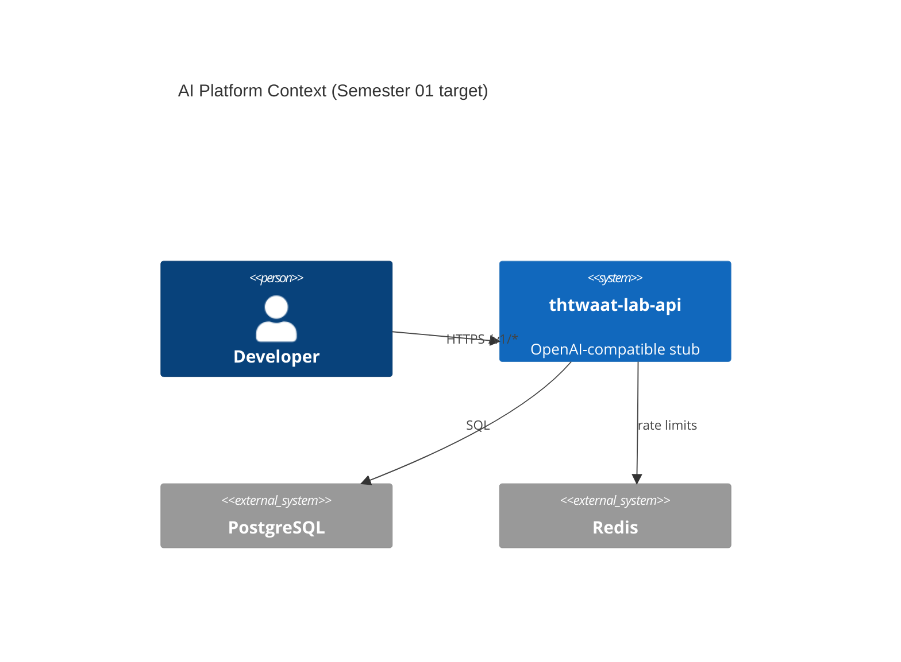

# Semester 01 · Week 1 — Engineer OS: Mental Models, Linux, Shell, Git

**Weekly outcome:** A reproducible personal lab + GitHub repo `thtwaat-lab-api` with CI skeleton and a one-page architecture narrative.  
**Weekly project due:** Sunday — milestone `M1-bootstrap`.  
**THTWAAT link:** Every production service starts as a disciplined repo; this week builds that habit.

---

## Day 1 (Mon) — Concept: What is an AI Platform?

### Lesson

An **AI Platform** is not “a chatbot.” It is a **control plane + data plane + inference plane**:

| Plane | Responsibility | THTWAAT Cloud example |
|-------|----------------|------------------------|
| Control plane | Tenants, billing, domains, templates, RBAC | SaaS admin, marketplace, Stripe |
| Data plane | Requests, keys, usage meters, audits | API gateway, Postgres, Redis |
| Inference plane | Models, GPUs, queues, streaming tokens | Ollama/vLLM workers, Kafka/NATS jobs |

**Staff-level insight:** OpenAI/Anthropic/DeepMind platforms fail more often from **distributed systems + multi-tenancy + cost control** than from model quality alone.

### Architecture diagram (draw today)



### Lab (30 min)

Write a half-page answer in `docs/notes/week01-day1.md`:

1. Name 5 subsystems THTWAAT Cloud needs that ChatGPT UI does *not* need.
2. Map each to control / data / inference plane.

### Interview drill

- “Explain AI platform vs AI application in 60 seconds.”

### Reading

- DDIA Ch.1 (reliability, scalability, maintainability) — skim.

---

## Day 2 (Tue) — Linux mental model for services

### Lesson

Production AI services live inside **processes** constrained by:

- **CPU / memory cgroups** (K8s limits later; Docker `--memory` now)
- **File descriptors** (sockets to Postgres/Redis/clients)
- **Signals** (SIGTERM graceful shutdown — critical for in-flight streams)
- **Namespaces** (network/pid isolation)

**Graceful shutdown pattern (memorize):**

1. Stop accepting new connections  
2. Drain in-flight requests (deadline)  
3. Close pools  
4. Exit 0  

Streaming chat completions make this harder — Semester 03 revisits.

### Lab

On WSL/Linux/macOS:

```bash
ps aux | head
ulimit -n
# Start any long Python sleep; send SIGTERM; observe
```

Document what happens if you ignore SIGTERM (K8s kills with SIGKILL after `terminationGracePeriodSeconds`).

### Debugging exercise

Symptom: “API hangs on deploy.”  
Hypothesis list: missing SIGTERM handler, DB pool not closed, stuck Redis BL POP, zombie child.

### Interview

- Difference between SIGTERM and SIGKILL?
- Why do we need readiness ≠ liveness?

### Reading

- Linux man pages: `signal(7)` overview  
- Kubernetes docs: Container Lifecycle (read ahead; apply mentally to Docker first)

---

## Day 3 (Wed) — Lab: Shell fluency for platform engineers

### Lab checklist (complete all)

```bash
# 1. Workspace
mkdir -p ~/thtwaat-academy && cd ~/thtwaat-academy

# 2. Inspect network listeners (when docker later)
ss -lptn || netstat -lptn

# 3. Disk & memory awareness
df -h
free -h || vm_stat

# 4. Text tools
echo '{"ok":true}' | jq .
curl -sS https://httpbin.org/get | jq .origin
```

Create alias notes for: `kubectl` (future), `docker compose`, `psql`, `redis-cli`.

### Deliverable

`docs/notes/week01-shell-cheatsheet.md` — your personal 20-command sheet.

### Production checklist fragment

- [ ] Can explain what port binding `0.0.0.0` vs `127.0.0.1` means for security

---

## Day 4 (Thu) — Debugging: “It works locally”

### Failure scenarios (pick 2, write RCA)

1. **Port already allocated** — Compose API won’t start  
2. **Wrong Python version** — typing syntax fails in CI  
3. **CRLF vs LF** on Windows — shell scripts fail in Linux CI  
4. **Clock skew** — JWT `nbf`/`exp` weirdness (preview)

### Method (use always)

1. Reproduce  
2. Bisect (config vs code vs env)  
3. Observe (logs, exit codes, `docker logs`)  
4. Fix + regression test  
5. Document in `docs/runbooks/`

### Exercise

Intentionally break a tiny script with a wrong shebang; fix it; write 5-line RCA.

---

## Day 5 (Fri) — Interview Friday + Git as product history

### Git for platform teams

- `main` protected  
- PR required  
- Conventional commits: `feat:`, `fix:`, `docs:`, `chore:`  
- Tags = releases (`sem01-v0.1.0`)  
- Never force-push shared main  

### Interview set (answer out loud, 2 min each)

1. What is a blast radius?  
2. Vertical vs horizontal scaling for an API?  
3. Why pin dependency versions in production images?  
4. What is an SBOM and why do platforms care?  
5. Describe least privilege for a DB role used by the API.

### Flashcards (create Anki or markdown)

- cgroup, namespace, inode, ephemeral port, Nagle’s algorithm (name only for now)

---

## Day 6 (Sat) — Weekly project: M1 bootstrap

### Build

1. Create GitHub repo `thtwaat-lab-api` (private or public).  
2. Structure:

```text
thtwaat-lab-api/
  README.md
  pyproject.toml or requirements.txt
  src/thtwaat_lab_api/__init__.py
  src/thtwaat_lab_api/main.py   # FastAPI app with /healthz only
  tests/test_health.py
  .github/workflows/ci.yml     # pytest only is enough this week
  .env.example
  docs/architecture/week01.md  # your diagram + narrative
```

3. Minimal app:

```python
from fastapi import FastAPI
app = FastAPI(title="thtwaat-lab-api")

@app.get("/healthz")
def healthz():
    return {"status": "ok"}
```

4. CI: install deps, run pytest.  
5. Open milestone `M1-bootstrap` and close it with PR.

### Architecture deliverable

In `docs/architecture/week01.md` include:

- Context diagram (who calls whom)  
- Non-goals for Sem 01 (no GPU, no K8s yet)  
- Risks (secrets, single-region, stub model)

---

## Day 7 (Sun) — Code review + reading catch-up

### Self code review checklist (Week 1)

- [ ] Repo clones clean on a second machine/WSL  
- [ ] `/healthz` returns 200  
- [ ] CI green  
- [ ] README states purpose + how to run  
- [ ] No secrets committed  
- [ ] Diagram present  
- [ ] Notes from Days 1–5 filed  

### Reading catch-up

- Finish DDIA Ch.1  
- Skim 12-Factor (I–III: codebase, dependencies, config)

### Exit ticket (message your mentor / Cursor)

Paste:

1. Link to repo  
2. Screenshot or CI URL green  
3. One paragraph: “What I still don’t understand about platforms”

---

## Week 1 production checklist

- [ ] Lab environment documented  
- [ ] GitHub repo live  
- [ ] Health endpoint  
- [ ] CI runs tests  
- [ ] Architecture note committed  

---

## Preview — Week 2

**Networking for platforms:** DNS, TLS mental model, latency budgets, `TIME_WAIT`, load balancers, and designing timeouts for OpenAI-compatible streaming (even before real GPUs).

Ask: **“Week 2”** when ready.
