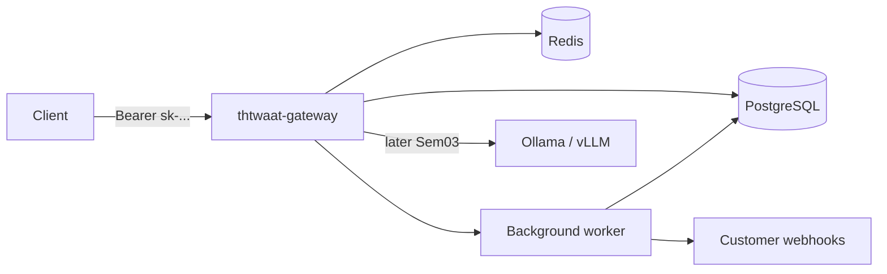

# Semester 02 — API Design & Data Engineering for AI Platforms

**Duration:** 4 weeks (compressed, production-intensity)  
**Prerequisite:** Semester 01 Hello Platform (`thtwaat-lab-api` health + CI)  
**Instructor mode:** **One day at a time** — do not skip ahead  
**Final project:** **THTWAAT OpenAI-Compatible API Gateway** (`thtwaat-gateway`)

---

## Learning outcomes

By the end of Semester 02 you can:

1. Design versioned, paginated, filterable multi-tenant HTTP APIs in FastAPI.
2. Model tenants, API keys, and usage in PostgreSQL with SQLAlchemy + Alembic.
3. Use Redis for caching, rate limiting, and idempotency keys.
4. Run background jobs for webhooks and usage flushes.
5. Expose OpenAI-compatible `/v1/models` and `/v1/chat/completions` (streaming + non-streaming).
6. Secure keys, scopes, and abuse paths; test and load-test the gateway.
7. Ship a Git-tagged gateway that could sit in front of Ollama/vLLM later (Sem 03).

---

## Four-week map

| Week | Theme | Git milestone | Weekly ship |
|------|-------|---------------|-------------|
| **1** | Multi-tenant API core + Postgres | `sem02-w1-api-core` | Tenants, keys, `/v1/models`, Alembic |
| **2** | Completions path + Redis controls | `sem02-w2-completions` | Chat completions, idempotency, rate limits, cache |
| **3** | Jobs, webhooks, usage | `sem02-w3-async-edge` | Background workers, webhooks, usage meters |
| **4** | Harden, test, performance, ship | `sem02-w4-gateway-ship` | Full gateway tag `sem02-v1.0.0` |

Daily cadence (every week):

| Day | Focus |
|-----|--------|
| Mon | Concepts + architecture |
| Tue | Deep dive / reading |
| Wed | Hands-on lab |
| Thu | Debugging exercise |
| Fri | Security + interview drill |
| Sat | Milestone build |
| Sun | Code review checklist + tag/PR |

---

## Final project — THTWAAT API Gateway

### Must-have routes (OpenAI-compatible)

- `GET /v1/models`
- `GET /v1/models/{model_id}`
- `POST /v1/chat/completions` (JSON + SSE streaming)
- Plus control plane: `POST /v1/api-keys`, tenant bootstrap (dev), `GET /v1/usage`

### Non-negotiables

- API versioning (`/v1`)
- Cursor or offset **pagination** on list endpoints
- **Filtering** (e.g. models by owned/public)
- **Caching** (models list in Redis)
- **Idempotency-Key** on completions
- **Rate limiting** per API key
- **Webhooks** on `completion.succeeded` / `completion.failed` (async)
- Alembic migrations; SQLAlchemy 2.x style
- Pytest: unit + API + concurrency smoke
- Docker Compose: `gateway`, `postgres`, `redis`, `worker`
- Structured logs + `request_id`
- Production checklist + threat model

### Target architecture

---

## Week index

- [Week 1](./week-01/README.md) — done (`sem02-w1-api-core`)
- [Week 2](./week-02/README.md) — done (`sem02-w2-completions`)
- [Week 3](./week-03/README.md) — done (`sem02-w3-async-edge`)
- [Week 4](./week-04/README.md) — done (`sem02-w4-gateway-ship` / `sem02-v1.0.0`)

**Semester 02 complete.** Next: Semester 03 (inference engineering) when unlocked.

---

## Global code review bar (every Sunday)

- [ ] Typed public APIs; no silent `except:`
- [ ] Tenant isolation proven by a failing cross-tenant test
- [ ] Migrations upgrade/downgrade documented
- [ ] Redis failure behavior documented (fail open vs closed)
- [ ] No secrets in git
- [ ] OpenAPI matches behavior
- [ ] README runbook: migrate, run, test, compose up
