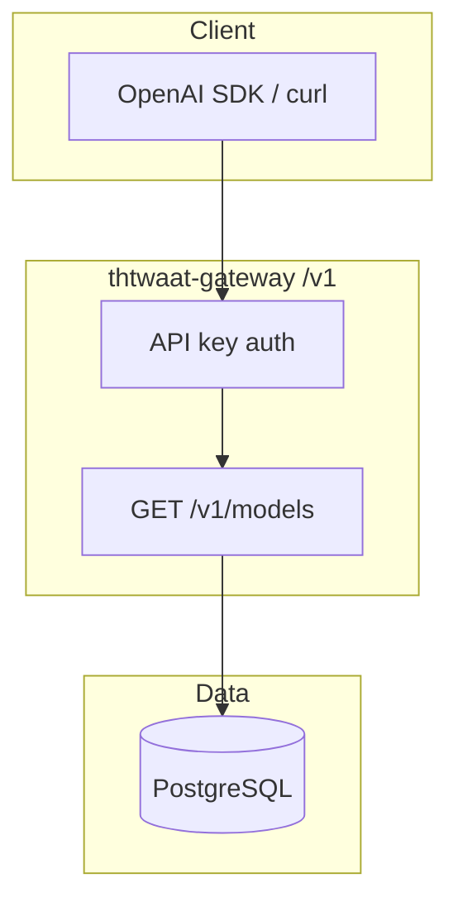

# Sem 02 · Week 1 · Day 1 — Multi-tenant API architecture & the OpenAI surface

**Timebox:** 60–90 minutes  
**Mode:** Concepts + architecture (no heavy coding yet)  
**Tomorrow:** SQLAlchemy models for tenants / keys / models catalog

---

## 1. Why this week exists

THTWAAT Cloud is multi-tenant. If you get **tenancy wrong**, every feature later (billing, agents, domains) becomes a data-leak factory.

Semester 02 Week 1 builds the **data plane entrance**:

- Who is the caller? → **API key → tenant**
- What can they see? → **tenant-scoped rows + public catalog**
- What does the industry expect? → **OpenAI-compatible URLs and shapes**

---

## 2. Lesson — Multi-tenant patterns (pick deliberately)

| Pattern | Idea | When |
|---------|------|------|
| **Shared DB, shared schema, `tenant_id` column** | One Postgres, every row stamped | **Default for THTWAAT gateway (use this)** |
| Shared DB, schema-per-tenant | `tenant_abc.users` | Rare; ops heavy |
| DB-per-tenant | Strong isolation, high cost | Enterprise tier later |

**Rule for this course:** shared schema + `tenant_id` on all tenant-owned tables. Enforce in **repository/service layer**, not “hope the SQL is right.”

### Isolation checklist (memorize)

1. Resolve auth → `tenant_id` once per request  
2. Never accept `tenant_id` from the client body as authority  
3. Every SELECT/UPDATE/DELETE includes tenant predicate  
4. Write a **cross-tenant negative test** that must fail  

---

## 3. Lesson — OpenAI-compatible surface (contract first)

You are not inventing a random RPC. Clients (SDKs, LangChain, curl scripts) expect:

```http
GET /v1/models
Authorization: Bearer sk-...
```

```http
POST /v1/chat/completions
Authorization: Bearer sk-...
Content-Type: application/json
```

**Versioning:** put breaking changes under `/v2` later; keep `/v1` stable.  
**Compatibility:** field names (`id`, `object`, `created`, `owned_by` for models) matter more than perfect internal beauty.

Week 1 implements **models** only. Completions arrive Week 2.

### Example models list shape (target)

```json
{
  "object": "list",
  "data": [
    {
      "id": "thtwaat-stub-mini",
      "object": "model",
      "created": 1710000000,
      "owned_by": "thtwaat"
    }
  ]
}
```

Pagination: OpenAI’s public API is often unpaginated for models; **your platform** still needs pagination skills — expose `limit`/`offset` (or cursor) as **extensions** without breaking `object`/`data`.

---

## 4. Architecture — Day 1 diagram (draw this in your repo)



**C4 context note (3 sentences):** Developer authenticates with a tenant API key; gateway authorizes against Postgres; model catalog is public + optional tenant-private fine-tunes (private rows filtered by tenant).

---

## 5. Hands-on lab (today — design artifacts only)

Create folder (in `thtwaat-gateway` or notes repo):

`docs/semester-02/week-01/day-01/`

### Lab A — ADR (Architecture Decision Record)

File: `adr-001-tenancy.md`

```markdown
# ADR 001: Shared-schema multi-tenancy

## Status
Accepted (Semester 02)

## Context
THTWAAT needs many tenants on one gateway.

## Decision
Shared PostgreSQL schema with tenant_id columns.

## Consequences
+ Simple ops, cheap
- Must enforce isolation in code + tests
- Noisy neighbor risk (mitigate with rate limits in Week 2)
```

### Lab B — OpenAPI sketch (handwritten or YAML stub)

File: `openapi-stub-v1-models.yaml`

Specify:

- `GET /v1/models`
- query: `limit`, `offset`, `owned` (enum: `any` | `public` | `mine`)
- security: HTTP bearer
- 401 / 200 responses

### Lab C — Threat lines (5 bullets)

File: `threats-day01.md`

Examples to include:

- IDOR on `GET /v1/models/{id}` for another tenant’s private model  
- API key in logs  
- Timing attacks on key verification (mention hash compare)  

---

## 6. Production checklist fragment (Day 1)

- [ ] Tenancy pattern chosen and written as ADR  
- [ ] OpenAI URL map listed (`/v1/models` now; `/v1/chat/completions` deferred)  
- [ ] Explicit: client-supplied `tenant_id` is **not** trusted  

---

## 7. Interview drill (answer out loud)

1. Why is “schema per tenant” painful for migrations?  
2. What is an IDOR and how do you test for it?  
3. Why do platforms copy OpenAI’s URL layout?  
4. Offset vs cursor pagination — one pro/con each.  
5. Where should API keys live: Redis or Postgres? (Week 1 answer: **Postgres source of truth**; Redis later for hot rate-limit state.)

---

## 8. Reading (30–40 min)

- FastAPI: Bigger Applications / Security  
- Stripe-style API keys mental model (prefix `sk_live_` / `sk_test_` — you’ll use `sk_tht_`)  
- OWASP: API1 Broken Object Level Authorization  
- SQLAlchemy 2.0 overview (prep for Day 2)

---

## 9. Exit ticket (required before Day 2)

Reply to your instructor (or paste in chat) with:

1. Link/path to `adr-001-tenancy.md`  
2. Your `owned` filter semantics in one sentence  
3. One sentence: how a cross-tenant models test will fail closed  

**Do not start SQLAlchemy models until Day 2.** Design first.

---

## Next

When exit ticket is done, say: **Day 2** (or “Sem 02 Week 1 Day 2”).
