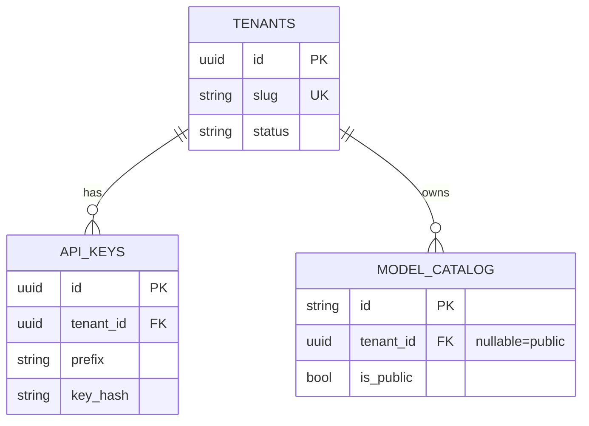

# Sem 02 · Week 1 · Day 2 — SQLAlchemy 2 + PostgreSQL modeling

**Timebox:** 90–120 minutes  
**Depends on:** Day 1 ADR (shared-schema + `tenant_id`)  
**Tomorrow:** Alembic lab (generate + apply initial migration)

---

## 1. Lesson — SQLAlchemy 2.0 style (what changed)

Prefer **2.0 style**:

- `DeclarativeBase` + mapped columns (`Mapped[...]`, `mapped_column`)
- Explicit sessions; avoid legacy `query` in new code when possible
- Relationships with `relationship(...)` typed where useful

**Platform rule:** models = schema truth; business rules live in services/repositories (isolation predicates).

---

## 2. Lesson — Tables for Week 1

| Table | Purpose |
|-------|---------|
| `tenants` | Customer org |
| `api_keys` | Bearer secrets (hashed), belong to tenant |
| `model_catalog` | Public + tenant-private model rows |

### Suggested columns

**tenants**

- `id` UUID PK  
- `slug` unique (`acme`)  
- `name`  
- `status` (`active` \| `suspended`)  
- `created_at`, `updated_at`

**api_keys**

- `id` UUID PK  
- `tenant_id` FK → tenants (CASCADE)  
- `name`  
- `prefix` (e.g. `sk_tht_ab12`) — safe to show in UI  
- `key_hash` — **never** store plaintext  
- `scopes` JSON/array optional (`models:read`, later `completions:write`)  
- `revoked_at` nullable  
- `created_at`

**model_catalog**

- `id` string PK OpenAI-style (`thtwaat-stub-mini`) **or** UUID + `public_id`  
- `tenant_id` **nullable** — `NULL` = global/public catalog  
- `owned_by` display string (`thtwaat` / tenant slug)  
- `display_name`  
- `is_public` bool  
- `created_at` (unix or timestamptz; expose unix in API)

**Indexes**

- `api_keys(prefix)` unique or unique(prefix)  
- `api_keys(tenant_id)`  
- `model_catalog(tenant_id, is_public)`  
- `tenants(slug)` unique  

---

## 3. Architecture — ER (draw + commit)



---

## 4. Hands-on lab

### Lab A — Repo layout

If not created yet:

```text
thtwaat-gateway/
  app/
    __init__.py
    db.py          # engine, SessionLocal, Base
    models/
      __init__.py
      tenant.py
      api_key.py
      model_catalog.py
    schemas/       # pydantic — stub ok
  alembic/         # Day 3
  tests/
  docker-compose.yml
  .env.example
  README.md
```

### Lab B — Implement models (code today)

**`app/db.py`**

- `DATABASE_URL` from env  
- `engine = create_engine(...)`  
- `SessionLocal = sessionmaker(bind=engine, autoflush=False, autocommit=False)`  
- `class Base(DeclarativeBase): ...`

**Models** — use UUID primary keys (`uuid4`), timezone-aware timestamps.

**Key hashing helper** (same module or `app/security/keys.py`):

```python
import hashlib
import secrets

def generate_api_key() -> tuple[str, str, str]:
    """Returns (plaintext, prefix, sha256_hex)."""
    raw = secrets.token_urlsafe(32)
    plaintext = f"sk_tht_{raw}"
    prefix = plaintext[:12]
    digest = hashlib.sha256(plaintext.encode()).hexdigest()
    return plaintext, prefix, digest
```

Show plaintext **once** at creation; persist only `prefix` + `key_hash`.

### Lab C — Seed sketch (script or pytest fixture, no HTTP yet)

1. Create tenant `acme`  
2. Create one API key (print plaintext in test output only)  
3. Insert public model `thtwaat-stub-mini` (`tenant_id=NULL`, `is_public=True`)  
4. Insert private model `acme-custom` (`tenant_id=acme`, `is_public=False`)

Use `Base.metadata.create_all` **only for local experiment today**. Day 3 moves to Alembic; delete reliance on `create_all` for “prod path.”

### Lab D — Isolation query drill (write SQL or ORM)

Write three queries in `docs/.../day-02-queries.md`:

1. List models for tenant T with `owned=public` → only `is_public` / `tenant_id IS NULL`  
2. `owned=mine` → `tenant_id = T`  
3. `owned=any` → public **OR** `tenant_id = T`  

Prove privately that tenant B never sees `acme-custom`.

---

## 5. Debugging exercise

**Symptom:** “UniqueViolation on api_keys_prefix” after re-running seed.

**Tasks:**

1. Why did it happen?  
2. Make seed **idempotent** (get-or-create by `tenants.slug`, skip key if prefix exists, upsert models by id).  

---

## 6. Production checklist (Day 2)

- [ ] No plaintext API keys in DB  
- [ ] FKs + `ON DELETE CASCADE` on `api_keys.tenant_id`  
- [ ] Nullable `model_catalog.tenant_id` documented  
- [ ] Indexes listed in README  
- [ ] `.env.example` has `DATABASE_URL`  

---

## 7. Interview drill

1. Why hash API keys instead of encrypting them?  
2. What does a nullable `tenant_id` mean for authorization?  
3. `mapped_column` vs classic `Column` — why 2.0 style?  
4. Cascade delete: when is it dangerous?  
5. How do you rotate an API key without downtime?

---

## 8. Reading

- SQLAlchemy 2.0 ORM Declaring Mapped Classes  
- PostgreSQL UUID type  
- OWASP: storage of secrets / API keys  

---

## 9. Exit ticket (required before Day 3)

Paste:

1. Paths to your three model files  
2. Output of idempotent seed (tenant slug + model ids) — redact key plaintext after first line  
3. The ORM/SQL for `owned=any` in ≤5 lines  

**Do not** run Alembic autogenerate until Day 3 (instructor will walk safe workflow).

---

## Next

Say **Day 3** when the exit ticket is done.
