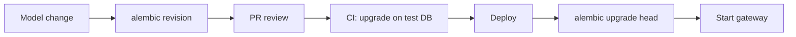

# Sem 02 · Week 1 · Day 3 — Alembic lab (migrations as product)

**Timebox:** 90–120 minutes  
**Depends on:** Day 2 SQLAlchemy models  
**Tomorrow:** Debugging migrations, connection pools, `/readyz`

---

## 1. Lesson — Why Alembic (not `create_all`)

| Approach | OK for | Danger |
|----------|--------|--------|
| `Base.metadata.create_all` | Local spike | No history; prod drift; no downgrade |
| **Alembic revisions** | Teams + prod | You must review autogenerate |

**Platform rule:** schema changes ship as **versioned migration files** in Git, applied in CI/CD and on boot (or release job) via `alembic upgrade head`.

THTWAAT / any serious AI gateway treats migrations like API contracts: reviewable, reversible when possible, idempotent where practical.

---

## 2. Lesson — Safe Alembic workflow

```bash
# 1. Models already match intended schema (Day 2)
# 2. One-time
alembic init alembic

# 3. Point env.py at your Base.metadata + DATABASE_URL
# 4. Autogenerate (ALWAYS review the file)
alembic revision --autogenerate -m "initial_tenants_keys_models"

# 5. Apply
alembic upgrade head

# 6. Prove empty-DB path
# drop schema / fresh compose volume → upgrade head again
```

### Review checklist for every autogenerate

- [ ] No unexpected drops  
- [ ] Enum/types match Postgres  
- [ ] Indexes/FKs present  
- [ ] Server defaults explicit where needed  
- [ ] Downgrade won’t silently destroy data you care about (document if irreversible)

### Commands to memorize

```bash
alembic current
alembic history
alembic upgrade head
alembic downgrade -1
alembic heads   # detect multiple heads / branch mess
```

---

## 3. Architecture — migration in the release path



Week 1: run migrations manually / Compose `gateway` entrypoint. Week 4: bake into release checklist.

---

## 4. Hands-on lab

### Lab A — Init Alembic

In `thtwaat-gateway`:

1. `alembic init alembic` (or `alembic.ini` + `alembic/env.py` by hand)  
2. `alembic.ini`: `sqlalchemy.url` **empty or placeholder** — prefer env var in `env.py`  
3. `env.py`:

- Import all models so metadata is complete  
- `target_metadata = Base.metadata`  
- Read `DATABASE_URL` from environment  
- Support offline/online migrations  

### Lab B — First revision

```bash
alembic revision --autogenerate -m "initial_tenants_api_keys_model_catalog"
```

Open the file. Confirm:

- `tenants`, `api_keys`, `model_catalog`  
- FK `api_keys.tenant_id` → `tenants.id`  
- Unique on `tenants.slug`, useful indexes  

If autogenerate missed something, **edit the revision by hand** (normal).

### Lab C — Apply + verify

```bash
alembic upgrade head
# psql or sqlalchemy inspect: tables exist
alembic current   # should show your revision id
```

Re-run seed from Day 2 against migrated DB (not `create_all`).

### Lab D — Empty-DB proof (mandatory)

1. `docker compose down -v` (wipe Postgres volume) **or** drop/recreate database  
2. `alembic upgrade head`  
3. Seed again  
4. Write result in `docs/semester-02/week-01/day-03-empty-db.md`

### Lab E — Downgrade drill (careful)

```bash
alembic downgrade -1
# confirm tables gone / partial
alembic upgrade head
```

Document: “Is downgrade safe for this initial revision?” (Usually yes if empty.)

### Lab F — Compose wiring (light)

`docker-compose.yml`:

- `postgres` healthy  
- `gateway` depends_on healthy postgres  
- Optional: entrypoint script `alembic upgrade head && uvicorn ...`  

Do **not** block all day on perfect images — migration path is the grade.

---

## 5. Debugging exercise

Pick one and write RCA (`day-03-rca.md`):

**A.** `Target database is not up to date` / multiple heads  
**B.** Autogenerate produced empty revision  
**C.** `Can't locate revision identified by 'xxxx'` after rebase  
**D.** Enum alter fails on Postgres  

Include: cause → fix → prevention.

---

## 6. Production checklist (Day 3)

- [ ] `alembic upgrade head` from empty DB works  
- [ ] Models imported in `env.py` (no missing tables)  
- [ ] `DATABASE_URL` only via env  
- [ ] CI job (or documented command) runs migrations on test Postgres  
- [ ] README: migrate section with exact commands  
- [ ] No reliance on `create_all` in app startup for prod mode  

---

## 7. Interview drill

1. Expand vs contract migrations when renaming a column with zero downtime — outline steps.  
2. Why is “migrate on app boot” controversial? When is it OK?  
3. How do you detect migration drift between environments?  
4. What is a migration squash and when do you use it?  
5. Alembic vs Flyway/Liquibase — one similarity, one difference.

---

## 8. Reading

- Alembic tutorial: autogenerate  
- PostgreSQL transactional DDL notes  
- Expand/contract pattern (search “expand contract database migrations”)  

---

## 9. Exit ticket (before Day 4)

Paste:

1. Revision id (`alembic current`)  
2. Confirmation empty-DB upgrade worked (yes/no + one evidence line)  
3. Path to RCA file  
4. Whether gateway startup runs migrations (yes/no) and why you chose that  

---

## Next

Say **Day 4** when the exit ticket is done.
