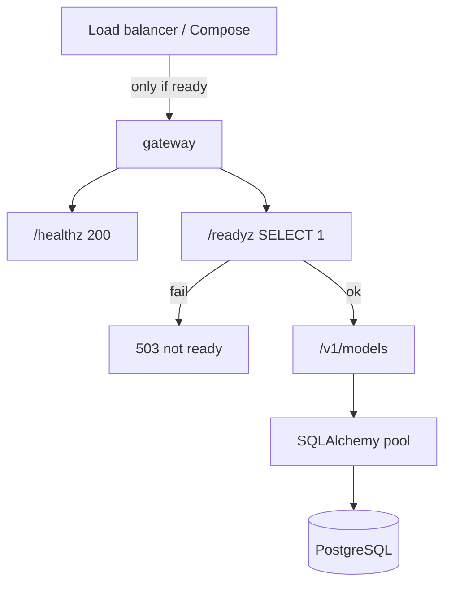

# Sem 02 · Week 1 · Day 4 — Debugging migrations, pools, and `/readyz`

**Timebox:** 90–120 minutes  
**Depends on:** Day 3 Alembic empty-DB path  
**Tomorrow:** API key authn dependency + interview Friday prep

---

## 1. Lesson — Liveness vs readiness (platform interview staple)

| Probe | Question it answers | Gateway behavior |
|-------|---------------------|------------------|
| **Liveness** `/healthz` | Process alive? | Cheap: return 200 if event loop up. **Do not** touch DB. |
| **Readiness** `/readyz` | Safe to send traffic? | Check **Postgres** (and later Redis). Fail → 503. |

Orchestrators (Compose healthcheck, K8s) remove unready instances from the load balancer. If `/readyz` always equals `/healthz`, you will take traffic while migrations are mid-flight or DB is down → cascading 500s.

**THTWAAT rule:**  
`/healthz` = process. `/readyz` = dependencies required to serve `/v1/*`.

---

## 2. Lesson — Connection pools under FastAPI

SQLAlchemy `create_engine` defaults matter:

- `pool_size`, `max_overflow` — concurrent DB checkouts  
- `pool_pre_ping=True` — drop dead connections (deploy/failover friendly)  
- `pool_timeout` — fail fast vs hang  

**Async note:** Sem 02 can stay sync Session + threadpool, or use `asyncpg` + `AsyncSession`. Pick one and document it. Mixing carelessly = pool exhaustion.

**Failure mode:** each request opens a new Engine → “too many connections” on Postgres.  
**Fix:** one Engine per process; session per request; close/rollback in `finally`.

```text
Request → Depends(get_db) → Session → commit/rollback → close
```

---

## 3. Lesson — Migration failures you will hit

| Symptom | Likely cause | Fix direction |
|---------|--------------|---------------|
| Multiple heads | Branched revisions | `alembic merge` or rebase linear history |
| Empty autogenerate | Models not imported in `env.py` | Import all model modules |
| Can’t locate revision | Rebase dropped file / wrong DB | Restore revision or `stamp` carefully |
| Lock timeout | Long migration under load | Expand/contract; maintenance window |
| Enum alter pain | Postgres enum quirks | Additive values; avoid rename-in-place |
| App 500 after deploy | App expects column migration didn’t add | Order: migrate **then** roll out code (or expand first) |

**Dangerous command:** `alembic stamp head` without knowing DB state — only for recovery with eyes open.

---

## 4. Architecture — traffic gate



---

## 5. Hands-on lab

### Lab A — Implement probes

```http
GET /healthz → {"status":"ok"}
GET /readyz  → {"status":"ok","postgres":true}  # or 503
```

`/readyz` implementation sketch:

1. Open short-lived session (or use `engine.connect()`)  
2. `SELECT 1`  
3. On success 200; on failure 503 + structured log  

**Test:** stop Postgres → `/healthz` still 200, `/readyz` 503. Start Postgres → `/readyz` 200.

### Lab B — Session hygiene

- `get_db()` dependency with `try/yield/finally: session.close()`  
- Ensure no global Session shared across requests  
- Log pool status once at startup (`engine.pool.status()`) in debug mode  

### Lab C — Break-fix migration drill

1. Create a **deliberately bad** revision (e.g. add `NOT NULL` column without default on non-empty table) **on a throwaway DB**  
2. Run `upgrade`, capture error  
3. Fix with a proper revision (default or backfill)  
4. Write `docs/.../day-04-migration-rca.md`

### Lab D — Pool exhaustion simulation (lightweight)

- Set tiny pool: `pool_size=1`, `max_overflow=0`  
- Fire concurrent requests (httpx / pytest-xdist / ab) that hold DB sessions too long (sleep in route **with session open** — anti-pattern for demo only)  
- Observe timeouts  
- Fix: release session before sleep / shrink critical section  
- Document in `day-04-pool-notes.md`

### Lab E — Startup ordering

Compose or script:

1. Wait for Postgres TCP  
2. `alembic upgrade head`  
3. Start uvicorn  

Prove: boot against empty volume succeeds end-to-end.

---

## 6. Debugging exercise (pick 2)

Write RCAs:

1. `/readyz` flapping every few minutes  
2. Intermittent `QueuePool limit overflow`  
3. Deploy green but all `/v1/models` return 500 for 2 minutes  
4. Migration succeeded on staging, failed on prod (different data)

Use format: Symptom → Timeline → Hypotheses → Evidence → Fix → Prevention.

---

## 7. Production checklist (Day 4)

- [ ] `/healthz` does not query Postgres  
- [ ] `/readyz` fails when DB down  
- [ ] Automated test for health vs ready split  
- [ ] `pool_pre_ping=True` (or justified alternative)  
- [ ] One Engine per process  
- [ ] Documented migrate-then-serve boot order  
- [ ] RCA for at least one migration failure  

---

## 8. Interview drill

1. Why shouldn’t liveness check the database?  
2. What happens if readiness always returns 200?  
3. Explain `pool_size` vs `max_overflow`.  
4. How do you roll out a blocking migration with near-zero downtime?  
5. App connects with 50 workers × pool_size 10 — what’s wrong?

---

## 9. Reading

- SQLAlchemy Engine Configuration (pooling)  
- Kubernetes probe docs (even if you only use Compose today)  
- Postgres `max_connections` vs PgBouncer (awareness)  

---

## 10. Exit ticket (before Day 5)

Paste:

1. Proof: DB down → healthz 200, readyz 503 (commands or test name)  
2. Pool settings you chose (`pool_size`, `max_overflow`, `pool_pre_ping`)  
3. Path to migration RCA  
4. One sentence boot order  

---

## Next

Say **Day 5** when the exit ticket is done.
