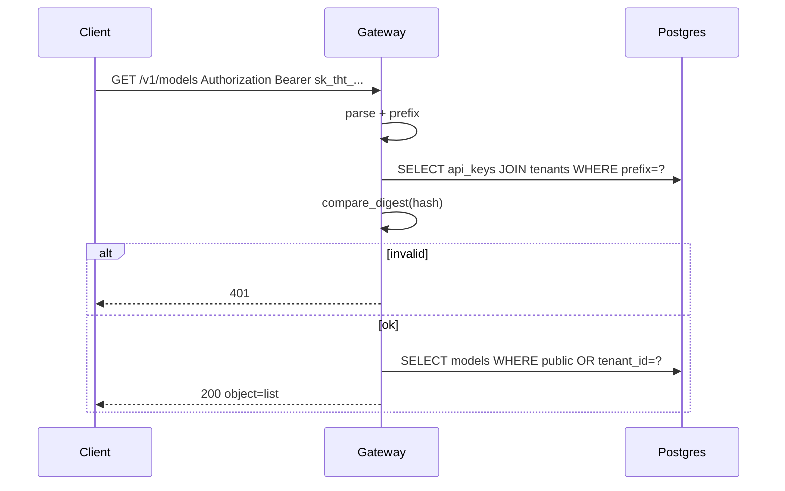

# Sem 02 · Week 1 · Day 5 — API key authentication & security interview

**Timebox:** 90–120 minutes  
**Depends on:** Day 2 key hashing + Day 4 `/readyz`  
**Tomorrow (Sat):** Milestone build `sem02-w1-api-core`  
**Sunday:** Code review + tag

---

## 1. Lesson — Authn vs authz (say it cleanly)

| Term | Meaning | Gateway Week 1 |
|------|---------|----------------|
| **Authentication** | Who is calling? | Resolve `Authorization: Bearer sk_tht_...` → `api_keys` row → `tenant` |
| **Authorization** | What may they do? | Scopes later; for now: “valid non-revoked key” + tenant isolation on reads |

Never confuse “we found a key” with “they may read another tenant’s private model.”

---

## 2. Lesson — API key design for AI platforms

**Format (recommended):**

```text
sk_tht_<high_entropy>
prefix = first 12 chars   # indexed lookup
key_hash = SHA-256(plaintext)  # or argon2/bcrypt if you accept CPU cost
```

**Lookup path (constant-ish):**

1. Parse `Bearer` scheme  
2. Reject missing/malformed → 401  
3. Lookup by **prefix** (cheap index)  
4. Compare hash with `hmac.compare_digest`  
5. Reject if `revoked_at` set or tenant `suspended`  
6. Attach `RequestContext(tenant_id, api_key_id, scopes)` to request state  

**Do not:**

- Log full keys  
- Put keys in query strings  
- Accept `tenant_id` from body as identity  
- Use only prefix match without hash verify  

**Optional Week 1 scopes:** store JSON list; enforce `models:read` on `/v1/models`. Default: any valid key can read models.

---

## 3. Lesson — FastAPI dependency pattern

```text
get_db → get_current_principal(Authorization) → route
```

`get_current_principal`:

- Raises `HTTPException(401)` on failure  
- Returns dataclass/Pydantic `Principal`  
- Used by `GET /v1/models` so unauthenticated list is impossible (OpenAI also requires a key)

Public health endpoints stay **without** this dependency.

---

## 4. Architecture — authn flow



---

## 5. Hands-on lab

### Lab A — Create key endpoint (dev/admin)

`POST /v1/admin/tenants/{tenant_id}/api-keys` **or** bootstrap:

`POST /v1/admin/api-keys` with tenant slug (dev-only, protect with `ADMIN_TOKEN` env later).

Response **once**:

```json
{
  "id": "...",
  "prefix": "sk_tht_ab12",
  "api_key": "sk_tht_ab12....full",
  "message": "Store this key; it will not be shown again"
}
```

Persist only hash + prefix.

### Lab B — Auth dependency

Wire `GET /v1/models` and `GET /v1/models/{id}` behind bearer auth.

Cases:

| Call | Expect |
|------|--------|
| No header | 401 |
| Bad key | 401 |
| Revoked key | 401 |
| Valid key | 200 |

### Lab C — Isolation with auth

Tenant A key must **not** fetch tenant B private model by id → **404** (prefer 404 over 403 to reduce existence leaks) or 403 — **pick one, document, test**.

### Lab D — Security smoke tests

Pytest:

1. Cross-tenant GET by id fails closed  
2. Hash compare uses `compare_digest` (code review assertion)  
3. Access log fixture does not contain raw `sk_tht_` full secret  

### Lab E — Interview flashcards (write answers)

Create `docs/.../day-05-interview.md` with your answers to section 8.

---

## 6. Debugging exercise

**Symptom:** Intermittent 401 for a valid key after deploy.

Hypotheses to investigate:

- Wrong `DATABASE_URL` (empty keys table)  
- Prefix truncation mismatch (12 vs 16 chars)  
- Unicode/whitespace in header  
- Clock not relevant for keys — don’t blame JWT  
- Multiple gateway replicas pointing at different DBs  

Write RCA after you reproduce one failure deliberately (e.g. truncate prefix to 10 in verify path).

---

## 7. Production checklist (Day 5)

- [ ] Keys hashed at rest  
- [ ] `compare_digest` for verification  
- [ ] 401 on missing/invalid/revoked  
- [ ] Health endpoints unauthenticated  
- [ ] Models routes authenticated  
- [ ] Cross-tenant negative test green  
- [ ] No full key in logs (spot-check)  
- [ ] Key creation returns plaintext only once  

---

## 8. Interview drill (Friday set — answer out loud + write)

1. API key vs JWT for machine-to-machine LLM gateways — trade-offs?  
2. Why look up by prefix before hash compare?  
3. 401 vs 403 vs 404 for a private model id from another tenant?  
4. How do you rotate keys with zero downtime?  
5. Where would you add per-key rate limits (Week 2) without breaking authn?  
6. What is a confused deputy in multi-tenant APIs?  
7. Should `/v1/models` be public without a key on THTWAAT? Why/why not?

---

## 9. Reading

- OWASP API Security Top 10 — API1 BOLA, API2 broken auth  
- FastAPI Security: HTTPBearer  
- RFC 7235 (WWW-Authenticate awareness)  

---

## 10. Exit ticket (before Saturday Day 6)

Paste:

1. Auth dependency function name + route list protected  
2. Test names for 401 + cross-tenant deny  
3. Policy choice: cross-tenant model id → 404 or 403  
4. Path to `day-05-interview.md`  

---

## Preview — Day 6 (Saturday milestone)

Ship `sem02-w1-api-core`: tenants, keys, Alembic, `/v1/models` pagination+filter, probes, auth, Compose, CI, README ER diagram.

---

## Next

Say **Day 6** when the exit ticket is done.
