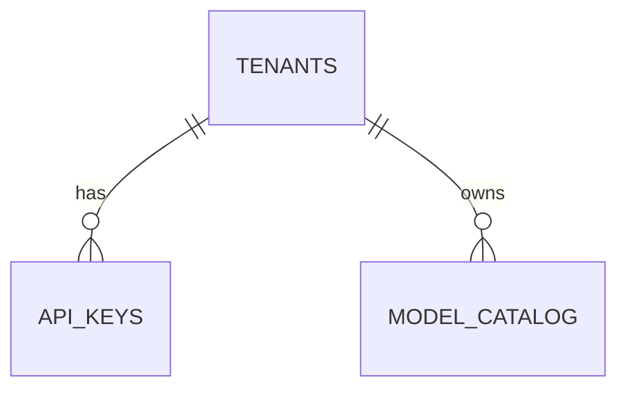

# Sem 02 · Week 1 · Day 6 — Milestone build (`sem02-w1-api-core`)

**Timebox:** 3–5 hours (Saturday project day)  
**Depends on:** Days 1–5 (ADR, models, Alembic, probes, API key auth)  
**Tomorrow:** Day 7 code review checklist + Git tag  

---

## 1. Mission

Ship a **Git-ready** THTWAAT gateway slice:

> Multi-tenant OpenAI-compatible **models** API on FastAPI + PostgreSQL + Alembic + bearer API keys + health/ready + Compose + CI.

**Out of scope today:** completions, Redis, webhooks, streaming (Week 2+).

**Target tag (Day 7):** `sem02-w1-api-core`

---

## 2. Definition of Done (DoD)

All boxes must be true before you call Day 6 complete:

### API

- [ ] `GET /healthz` → 200 without DB  
- [ ] `GET /readyz` → 200 with DB; 503 if DB down  
- [ ] `POST` tenant bootstrap (dev/admin) documented  
- [ ] `POST` API key create → plaintext once; hash stored  
- [ ] `GET /v1/models` requires bearer key  
- [ ] Pagination: `limit` + `offset` (document caps, e.g. limit≤100)  
- [ ] Filter: `owned=any|public|mine`  
- [ ] `GET /v1/models/{id}` tenant-safe (cross-tenant private → 404 or 403 per Day 5 policy)  
- [ ] Response shape includes OpenAI-like `object` / `data` / model fields  

### Data

- [ ] Tables: `tenants`, `api_keys`, `model_catalog`  
- [ ] `alembic upgrade head` from **empty** DB  
- [ ] Idempotent seed: ≥1 public model + optional private  

### Quality

- [ ] Pytest: 401, happy list, pagination, owned filter, cross-tenant deny, ready/health split  
- [ ] CI workflow runs pytest (and preferably migrate on service Postgres)  
- [ ] `docker compose up` runs postgres + gateway  
- [ ] README: ER diagram, runbook (migrate, seed, curl examples)  
- [ ] `.env.example` complete; no secrets in git  

---

## 3. Suggested build order (follow this)

```text
09:00  Repo hygiene + README skeleton
09:30  Confirm migrations on fresh volume
10:00  Auth dependency + admin key/tenant routes
11:00  GET /v1/models + pagination + owned filter
12:00  GET /v1/models/{id} + isolation
13:00  Probes + compose healthchecks
14:00  Tests + CI green
15:00  Seed script + curl script + OpenAPI check
16:00  Self-review against DoD; open PR / commit
```

Adjust times; **DoD order beats perfectionism.**

---

## 4. Architecture (commit this)

```mermaid
flowchart LR
  Client -->|Bearer sk_tht_| GW[thtwaat-gateway]
  GW --> H[/healthz]
  GW --> R[/readyz]
  GW --> M["/v1/models"]
  R --> PG[(PostgreSQL)]
  M --> PG
```



File: `docs/architecture/sem02-w1.md`

---

## 5. Hands-on lab — curl acceptance script

Create `scripts/smoke_w1.sh` (or `.ps1`) that:

1. Waits for `/readyz`  
2. Creates tenant + key (capture key)  
3. Seeds/ensures public model  
4. `GET /v1/models?owned=public&limit=10`  
5. Fails if any step non-2xx  

Run it once green and paste output into Day 6 notes (redact key).

---

## 6. Debugging budget

If stuck >25 minutes on one bug:

1. Write the failing command + status + body  
2. Bisect: auth vs SQL vs pagination  
3. Add one failing test that reproduces  
4. Only then ask for help / move to next DoD item  

Common Day 6 failures:

- `/v1/models` 200 without auth (dependency not applied)  
- `owned=mine` returns public rows  
- Pagination off-by-one / negative offset  
- Readyz true while pointing at wrong DB  
- CI green locally but migrate missing in CI  

---

## 7. Production checklist (pre-tag)

- [ ] Empty-DB migrate + seed + smoke script  
- [ ] Cross-tenant test in CI  
- [ ] Rate of logging: request_id present (bonus if already done)  
- [ ] Admin routes clearly marked **dev** or gated  
- [ ] OpenAPI reflects query params and security scheme  

---

## 8. Interview (short — while tests run)

Answer in `docs/.../day-06-notes.md`:

1. What would break if you skip `/readyz` behind a load balancer?  
2. Why pagination caps matter for `/v1/models`?  
3. One metric you would add in Week 2 for this gateway.

---

## 9. Exit ticket (before Day 7)

Paste:

1. Repo link or local path  
2. DoD checklist — remaining open items (ideally none)  
3. Smoke script result (redacted)  
4. Commit SHA you will tag tomorrow  

**Do not tag yet** unless Day 7 review is done — Day 7 owns `sem02-w1-api-core`.

---

## Next

Say **Day 7** for the formal code review checklist and tag ceremony.
