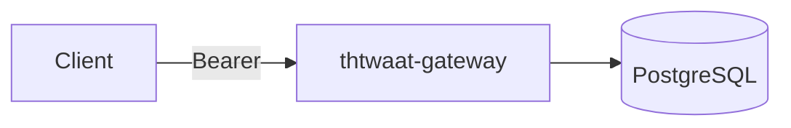

# Sem 02 · Week 1 · Day 7 — Code review + tag `sem02-w1-api-core`

**Timebox:** 90–150 minutes  
**Depends on:** Day 6 DoD essentially complete  
**Unlocks:** **Week 2** (completions, Redis, idempotency, rate limits)

---

## 1. Today’s ceremony

1. Run the **Week 1 code review checklist** (below) — every item yes/no with evidence  
2. Fix blockers only (no Week 2 features)  
3. Re-run smoke + pytest  
4. Tag and push: **`sem02-w1-api-core`**  
5. Write a short **milestone retrospective**  

If any **blocker** fails, do **not** tag. Fix, then retag.

---

## 2. Week 1 official code review checklist

Copy into `docs/semester-02/week-01/REVIEW.md` and check off with links/commands.

### A. Product / API contract

- [ ] OpenAI-like `GET /v1/models` and `GET /v1/models/{id}` exist  
- [ ] List supports `limit`, `offset`, and `owned=any|public|mine`  
- [ ] OpenAPI (or FastAPI `/docs`) matches real query params + bearer security  
- [ ] Unauthenticated models calls return **401**  
- [ ] Pagination caps enforced (e.g. `1 ≤ limit ≤ 100`, `offset ≥ 0`)  

### B. Multi-tenancy & security

- [ ] API keys stored as hash; plaintext only on create  
- [ ] Verification uses `hmac.compare_digest` (or equivalent)  
- [ ] Revoked / suspended paths return 401  
- [ ] Cross-tenant private model access fail-closed (404 or 403 — documented)  
- [ ] Client cannot set authoritative `tenant_id`  
- [ ] No full API keys in logs (spot-check)  
- [ ] `/healthz` and `/readyz` remain unauthenticated  

### C. Data & migrations

- [ ] `alembic upgrade head` from empty database succeeds  
- [ ] Fresh Compose volume path documented and verified  
- [ ] Seed idempotent  
- [ ] FKs/indexes present (`tenants.slug`, `api_keys.prefix`, tenant FKs)  

### D. Reliability basics

- [ ] `/healthz` does not require DB  
- [ ] `/readyz` returns 503 when DB down (automated test preferred)  
- [ ] Single Engine per process; sessions closed  
- [ ] `pool_pre_ping` (or written justification)  

### E. Engineering hygiene

- [ ] Pytest covers: health/ready, 401, list filters, isolation  
- [ ] CI green on the tagged commit  
- [ ] `docker compose up` brings postgres + gateway  
- [ ] README: architecture diagram, migrate, seed, curl examples  
- [ ] `.env.example` present; secrets absent from git  
- [ ] Admin/bootstrap routes clearly labeled unsafe for prod  

**Blockers:** any unchecked item in **B** or empty-DB migrate failure in **C**, or missing 401 on models.

**Non-blockers:** missing request_id, perfect OpenAPI polish, admin token hardening (note as Week 2/4 debt).

---

## 3. Hands-on lab — review session

### Lab A — Adversarial pass (30–45 min)

Act as a hostile reviewer:

1. Try `owned=mine` with tenant A key after inserting tenant B private model — must not appear  
2. Try direct GET of B’s model id with A’s key  
3. Stop Postgres; confirm probe split  
4. Re-create same tenant slug seed twice — no crash  

Record results in `REVIEW.md`.

### Lab B — Tag ceremony

```bash
git status                 # clean
pytest                     # green
# optional: scripts/smoke_w1.sh
git tag -a sem02-w1-api-core -m "Sem02 W1: multi-tenant models API core"
git push origin sem02-w1-api-core   # if remote exists
```

If you cannot push, local annotated tag still counts — note it in retrospective.

### Lab C — Retrospective (1 page)

`docs/semester-02/week-01/RETRO.md`:

1. What shipped  
2. What slipped  
3. Top 3 risks entering Week 2  
4. One thing you’d teach a junior differently  

---

## 4. Architecture freeze (Week 1)

Paste final diagram into README if not already:



**Frozen for Week 1:** models catalog + keys + tenants.  
**Explicitly not frozen:** completions payload schema (Week 2 owns it).

---

## 5. Production checklist (gate to Week 2)

- [ ] `REVIEW.md` completed with no open blockers  
- [ ] Tag `sem02-w1-api-core` exists  
- [ ] Retro filed  
- [ ] Known debt list ≤5 bullets (e.g. “admin routes ungated”)  

---

## 6. Interview drill (graduation from Week 1)

Answer aloud (2 minutes each):

1. Walk me through authenticating a `/v1/models` request end-to-end.  
2. How does readiness differ from liveness in your gateway?  
3. Defend shared-schema multi-tenancy for THTWAAT at this stage.  
4. What breaks first under 100× traffic tomorrow — and what Week 2 adds?  

---

## 7. Exit ticket (Week 1 complete)

Paste:

1. Tag name + commit SHA  
2. `REVIEW.md` path + “blockers: none” (or list)  
3. Retro path  
4. Confirmation you want **Week 2 Day 1**  

---

## Week 2 preview

**Theme:** OpenAI-compatible `/v1/chat/completions`, Redis caching, idempotency keys, rate limiting, stub-or-proxy inference.

Milestone tag: `sem02-w2-completions`

---

## Next

Say **Week 2 Day 1** (or **Day 1** with Week 2 context) when the exit ticket is done.
