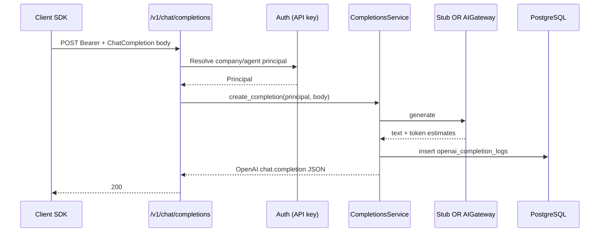

# Semester 02 · Week 2 · Day 1 — OpenAI-compatible `POST /v1/chat/completions`

**Status:** Implemented in THTWAAT core (`app/openai_compat`)  
**Tag target (end of Week 2):** `sem02-w2-completions`  
**Out of scope today:** Redis cache, Idempotency-Key, rate-limit headers, SSE streaming, usage billing flush (Days 2–5)

---

## Architecture



### Design decisions (ADR-lite)

| Decision | Choice | Why |
|----------|--------|-----|
| URL | Root `/v1/...` (not `/api/v1`) | OpenAI SDK `base_url` compatibility |
| Auth | `Authorization: Bearer` — agent `tht_*` keys **or** company `tht_key_*` | Reuse existing THTWAAT key systems |
| Inference Day 1 | `OPENAI_COMPAT_INFERENCE=stub\|gateway` (default stub in tests) | Deterministic CI; live path reuses `AIGatewayService` |
| Persistence | `openai_completion_logs` | Audit + foundation for Days 3–5 |
| Streaming | Deferred | Day 1 = JSON only; `stream:true` → 400 with clear message |

### Folder map

```text
app/openai_compat/
  dependencies.py   # principal resolution
  models.py         # CompletionLog ORM
  repository.py
  schemas.py        # OpenAI wire formats
  service.py
  stub.py
  router.py
docs/course/.../week-02/day-01.md  (this file)
alembic/versions/f2a3b4c5d6e7_openai_compat_completion_logs.py
tests/unit/openai_compat/test_chat_completions.py
```

---

## API contract (Day 1)

```http
POST /v1/chat/completions
Authorization: Bearer tht_key_... | tht_live_...
Content-Type: application/json
```

### Request example

```json
{
  "model": "thtwaat-stub-mini",
  "messages": [
    {"role": "system", "content": "You are a helpful assistant."},
    {"role": "user", "content": "Hello"}
  ],
  "temperature": 0.7,
  "max_tokens": 256,
  "stream": false
}
```

### Success response example

```json
{
  "id": "chatcmpl_abc123",
  "object": "chat.completion",
  "created": 1720000000,
  "model": "thtwaat-stub-mini",
  "choices": [
    {
      "index": 0,
      "message": {
        "role": "assistant",
        "content": "[thtwaat-stub:thtwaat-stub-mini] I received your message (5 chars). Live inference is available when OPENAI_COMPAT_INFERENCE=gateway."
      },
      "finish_reason": "stop",
      "logprobs": null
    }
  ],
  "usage": {
    "prompt_tokens": 12,
    "completion_tokens": 40,
    "total_tokens": 52
  },
  "system_fingerprint": "thtwaat-stub"
}
```

### OpenAPI

- Tag: **OpenAI Compatible**
- Security scheme: `AgentAPIKey` (Bearer `tht_live_*` / `tht_key_*`)
- Path: `POST /v1/chat/completions`
- Env: `OPENAI_COMPAT_INFERENCE=stub|gateway`

### Python SDK sketch

```python
from openai import OpenAI

client = OpenAI(base_url="http://localhost:8000/v1", api_key="tht_live_...")
resp = client.chat.completions.create(
    model="thtwaat-stub-mini",
    messages=[{"role": "user", "content": "Hello"}],
)
print(resp.choices[0].message.content)
```

---

## Production checklist (Day 1)

- [x] Architecture documented  
- [x] Repository + service layers  
- [x] Alembic migration for logs  
- [x] Auth required (401 without key)  
- [x] Stub path for tests  
- [x] Gateway path behind setting  
- [x] `stream:true` rejected clearly until later day  
- [x] Pytest coverage (`tests/unit/openai_compat/`)  
- [ ] Redis / idempotency / rate limit — **not today**

---

## Exit ticket → Day 2

When you approve Day 1, ask for **Day 2** (Redis caching only).
