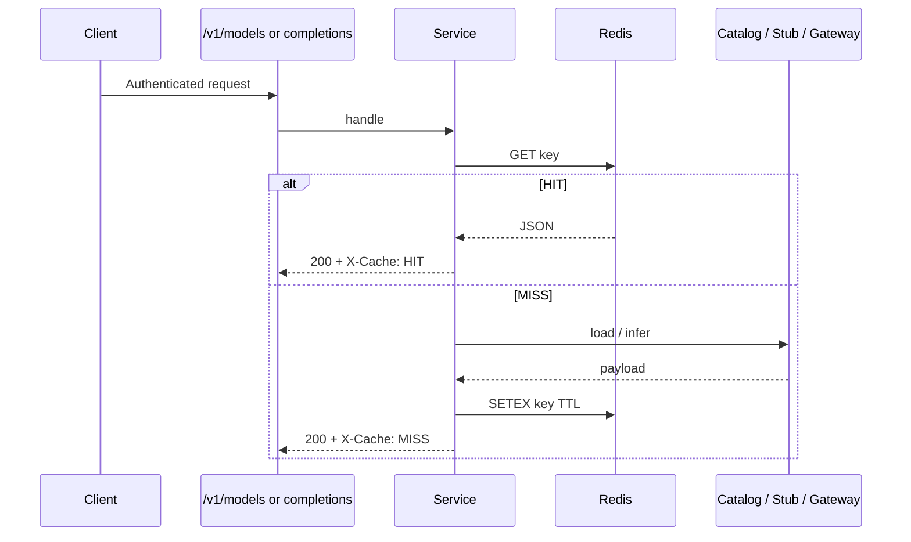

# Semester 02 · Week 2 · Day 2 — Redis caching

**Status:** Implemented in THTWAAT core (`app/openai_compat/cache.py`)  
**Depends on:** Day 1 (`POST /v1/chat/completions`)  
**Out of scope today:** Idempotency-Key (Day 3), rate-limit headers (Day 4), billing flush (Day 5)

---

## Architecture



### Design decisions (ADR-lite)

| Decision | Choice | Why |
|----------|--------|-----|
| Model metadata | Cache `GET /v1/models` (+ by-id) per tenant | Hot path; catalog changes infrequently |
| Completion responses | Cache **only** when `temperature == 0` | Deterministic enough to reuse safely |
| TTL | Separate model vs response TTLs (settings) | Models stay longer; completions stay short |
| Redis down | Soft-fail (bypass cache, serve origin) | Availability > cache purity |
| Keys | `tht:oai:models:{company}` / `tht:oai:model:...` / `tht:oai:cmpl:...` | Tenant-scoped; easy SCAN invalidate |
| Day 3 | Not touched | Idempotency-Key stays locked |

### Folder map

```text
app/openai_compat/
  cache.py           # Redis client + get/set/invalidate
  catalog.py         # Model metadata builder
  models_service.py  # Cached /v1/models
  service.py         # Response cache hook (temp==0)
  schemas.py         # ModelObject, ModelsListResponse
  router.py          # GET /v1/models[+/{id}]
docs/.../week-02/day-02.md
tests/unit/openai_compat/test_cache.py
```

---

## Settings

| Env | Default | Meaning |
|-----|---------|---------|
| `OPENAI_COMPAT_CACHE_ENABLED` | `true` | Master switch |
| `OPENAI_COMPAT_MODEL_CACHE_TTL_SECONDS` | `300` | Catalog TTL |
| `OPENAI_COMPAT_RESPONSE_CACHE_TTL_SECONDS` | `60` | Completion TTL |
| `OPENAI_COMPAT_CACHE_RESPONSES` | `true` | Allow temp=0 response cache |

---

## Invalidation

```python
from app.openai_compat.cache import OpenAICompatCache

cache = OpenAICompatCache()
cache.invalidate_models(company_id)
cache.invalidate_responses(company_id)
cache.invalidate_all(company_id)
```

Call these after admin mutates the model catalog (future write APIs).

---

## Production checklist (Day 2)

- [x] Model metadata cached with TTL  
- [x] Response cache only when appropriate (`temperature == 0`)  
- [x] Tenant-scoped invalidation  
- [x] Soft-fail if Redis unavailable  
- [x] `X-Cache: HIT|MISS|BYPASS` on models + cacheable completions  
- [x] Unit tests (fakeredis)  
- [ ] Idempotency-Key — **not today**

---

## Exit ticket → Day 3

When you approve Day 2, ask for **Day 3** (Idempotency-Key only).
