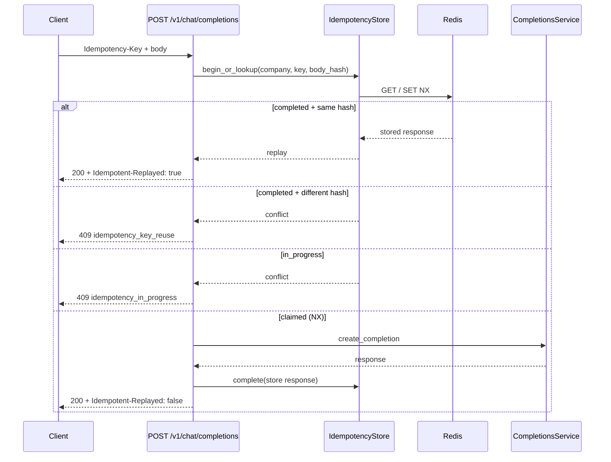

# Semester 02 · Week 2 · Day 3 — Idempotency-Key

**Status:** Implemented in THTWAAT core (`app/openai_compat/idempotency.py`)  
**Depends on:** Day 1 completions + Day 2 Redis client  
**Out of scope today:** Rate-limit headers (Day 4), usage/billing (Day 5)

---

## Architecture



### Design decisions (ADR-lite)

| Decision | Choice | Why |
|----------|--------|-----|
| Header | `Idempotency-Key` (optional) | Stripe / OpenAI-adjacent client convention |
| Scope | Per `company_id` + key | Tenant isolation |
| Body binding | SHA-256 of canonical request | Same key + different body → 409 |
| In-flight | Redis `SET NX` + `in_progress` | Concurrent retries do not double-charge inference |
| Storage | Redis JSON + TTL (default 24h) | No new Postgres table for Day 3 |
| Replay | Exact stored JSON + status | Safe retries after timeouts |
| vs Day 2 cache | Orthogonal | Cache = temp=0 content reuse; Idempotency = client key semantics |

### Folder map

```text
app/openai_compat/idempotency.py
app/openai_compat/service.py   # accepts optional key (wired from router)
app/openai_compat/router.py    # Header + replay headers
docs/.../week-02/day-03.md
tests/unit/openai_compat/test_idempotency.py
```

---

## Client contract

```http
POST /v1/chat/completions
Authorization: Bearer tht_live_...
Idempotency-Key: order-42-attempt-1
Content-Type: application/json
```

| Case | Result |
|------|--------|
| First request | 200, `Idempotent-Replayed: false` |
| Retry same key + same body | 200, stored body, `Idempotent-Replayed: true` |
| Same key + different body | 409 `idempotency_key_reuse` |
| Concurrent same key | 409 `idempotency_in_progress` |
| Missing header | Normal non-idempotent path |

---

## Settings

| Env | Default | Meaning |
|-----|---------|---------|
| `OPENAI_COMPAT_IDEMPOTENCY_ENABLED` | `true` | Master switch |
| `OPENAI_COMPAT_IDEMPOTENCY_TTL_SECONDS` | `86400` | Retention of stored responses |

---

## Production checklist (Day 3)

- [x] `Idempotency-Key` header  
- [x] Redis storage (tenant-scoped)  
- [x] Duplicate detection + replay  
- [x] Body mismatch → 409  
- [x] In-progress → 409  
- [x] Tests  
- [ ] Rate limiting — **not today**

---

## Exit ticket → Day 4

When you approve Day 3, ask for **Day 4** (Rate limiting only).
