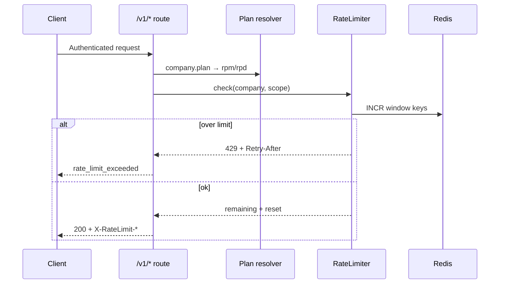

# Semester 02 · Week 2 · Day 4 — Tenant rate limiting

**Status:** Implemented in THTWAAT core (`app/openai_compat/rate_limit.py`)  
**Depends on:** Days 1–3 (completions + Redis client + idempotency)  
**Out of scope today:** Usage metering / cost / billing flush (Day 5)

---

## Architecture



### Design decisions (ADR-lite)

| Decision | Choice | Why |
|----------|--------|-----|
| Identity | `company_id` (tenant) | Matches multi-tenant gateway; not per-IP |
| Plans | Map from `Company.plan` (+ defaults) | Configurable tiers without new DB table |
| Windows | Fixed RPM (60s) + RPD (86400s) | Simple Redis counters; easy to reason about |
| Scopes | `completions` vs `models` | Completions are expensive; models stay lighter |
| Idempotent replay | Skip rate-limit increment | Retry must not burn the budget twice |
| Redis down | Soft-fail (allow + warn) | Availability > hard fail-closed for Day 4 |
| Headers | `Retry-After`, `X-RateLimit-Limit/Remaining/Reset` | Client-friendly; OpenAI-adjacent |

### Default plan limits (RPM / RPD)

| Plan | Completions RPM | Completions RPD | Models RPM |
|------|-----------------|-----------------|------------|
| free | 20 | 200 | 60 |
| starter | 60 | 2_000 | 120 |
| growth | 300 | 20_000 | 300 |
| enterprise | 2_000 | 500_000 | 1_000 |

Overrides via settings / `OPENAI_COMPAT_RATE_LIMIT_*`.

### Folder map

```text
app/openai_compat/rate_limit.py
app/openai_compat/router.py          # enforce before inference
docs/.../week-02/day-04.md
tests/unit/openai_compat/test_rate_limit.py
```

---

## Client contract

```http
HTTP/1.1 429 Too Many Requests
Retry-After: 42
X-RateLimit-Limit: 20
X-RateLimit-Remaining: 0
X-RateLimit-Reset: 1720000042
```

```json
{
  "detail": {
    "error": {
      "message": "Rate limit exceeded for plan 'free' (rpm).",
      "type": "rate_limit_error",
      "code": "rate_limit_exceeded",
      "plan": "free",
      "limit": 20,
      "window": "rpm"
    }
  }
}
```

---

## Production checklist (Day 4)

- [x] Tenant-based limits  
- [x] Redis counters (RPM + RPD)  
- [x] `Retry-After` + `X-RateLimit-*`  
- [x] Configurable plan map  
- [x] Tests  
- [ ] Usage / billing — **not today**

---

## Exit ticket → Day 5

When you approve Day 4, ask for **Day 5** (Usage tracking only).
