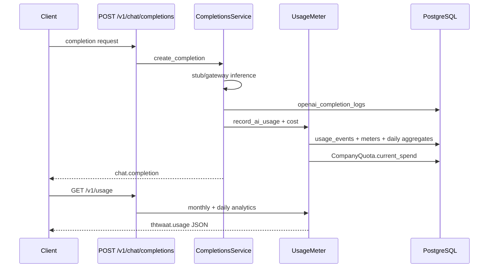

# Semester 02 · Week 2 · Day 5 — Usage tracking

**Status:** Implemented in THTWAAT core (`app/openai_compat/usage.py`)  
**Depends on:** Days 1–4  
**Out of scope today:** Streaming SSE, Week 2 harden/tag (Days 6–7)

---

## Architecture

### Design decisions (ADR-lite)

| Decision | Choice | Why |
|----------|--------|-----|
| Metering sink | Existing `UsageService` | Daily aggregates + monthly meters already production |
| Cost | Gateway `Resolvers` + `Tracker.calculate_cost` | One pricing table |
| Gateway path | `process_request(..., db=None)` | Avoid double-count; openai_compat owns flush |
| Cache HIT / idempotent replay | No new usage | Don’t bill retries twice |
| Analytics API | `GET /v1/usage` (THTWAAT extension) | API-key tenants need a non-JWT view |
| Billing hook | `upgrade_url` + spend bump on `CompanyQuota` | Ties into existing billing UX |

---

## Endpoints

### `GET /v1/usage`

Returns monthly counters, limits/progress, 30-day daily token series, and billing upgrade URL.

### Completions side-effect

Every fresh (non-cache, non-replay) completion records:

- `ai_messages`, `api_requests`
- `prompt_tokens`, `completion_tokens`, `total_tokens`
- estimated USD cost → `CompanyQuota.current_spend` when quota row exists

---

## Production checklist (Day 5)

- [x] Token usage flush  
- [x] Cost calculation  
- [x] Daily aggregates (via UsageService)  
- [x] Monthly meter  
- [x] Billing spend hook + upgrade URL  
- [x] Analytics (`GET /v1/usage`)  
- [x] Tests  
- [x] API healthcheck start_period hardened (prod deploy)

---

## Exit ticket → Days 6–7

When you approve Day 5, ask for **Week 2 Days 6–7** (harden + tag `sem02-w2-completions`).
