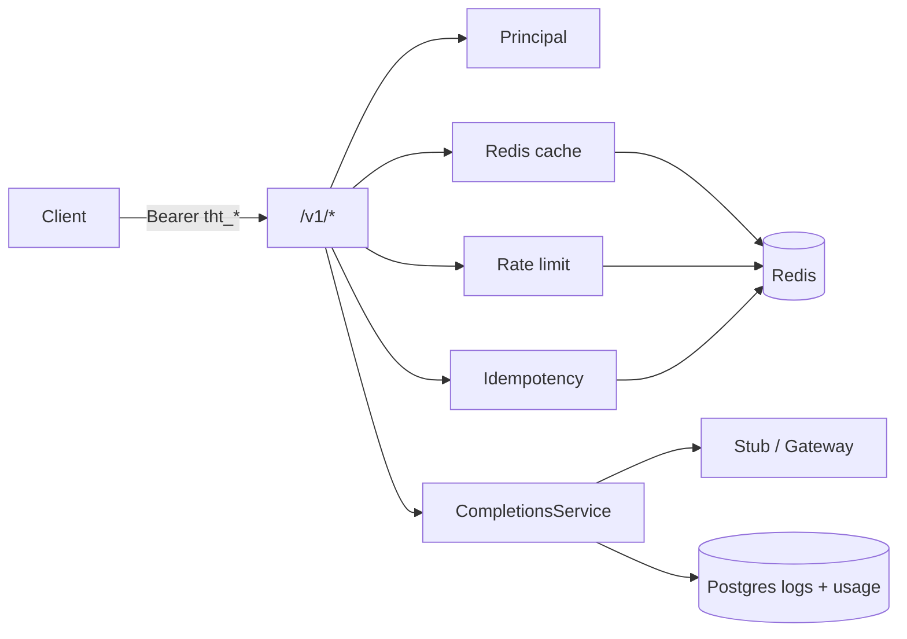

# Semester 02 · Week 2 · Day 6 — Milestone harden (`sem02-w2-completions`)

**Depends on:** Days 1–5 complete + VPS API healthy  
**Tomorrow:** Day 7 formal review + annotated Git tag  
**Target tag (Day 7):** `sem02-w2-completions`

---

## Definition of Done (Day 6)

All boxes must be true before Day 7 tag ceremony:

- [x] `POST /v1/chat/completions` (stub + gateway modes)
- [x] `GET /v1/models` + `GET /v1/models/{id}` (cached, paginated `limit`/`offset`)
- [x] Redis cache (`X-Cache`) + invalidation helpers
- [x] `Idempotency-Key` replay / conflict
- [x] Tenant/plan rate limits (`Retry-After`, `X-RateLimit-*`)
- [x] Usage flush + `GET /v1/usage`
- [x] `X-Request-ID` via `RequestContextMiddleware`
- [x] Prod healthcheck start_period hardened; FTS migration trigger-based
- [x] Smoke script: `scripts/smoke_w2_openai_compat.sh`
- [x] Unit tests under `tests/unit/openai_compat/`

**Out of scope (Week 3+):** SSE streaming, customer webhooks, separate gateway repo.

---

## Smoke

```bash
export API_BASE=https://api.thtwaat.com   # or http://127.0.0.1:8000
export API_KEY=tht_live_...
bash scripts/smoke_w2_openai_compat.sh
```

```bash
python -m pytest tests/unit/openai_compat/ -q
```

---

## Architecture freeze (Week 2)



---

## Exit ticket → Day 7

1. Smoke green (or noted env gap)  
2. Pytest openai_compat green  
3. Ask for **Day 7** review + tag  
