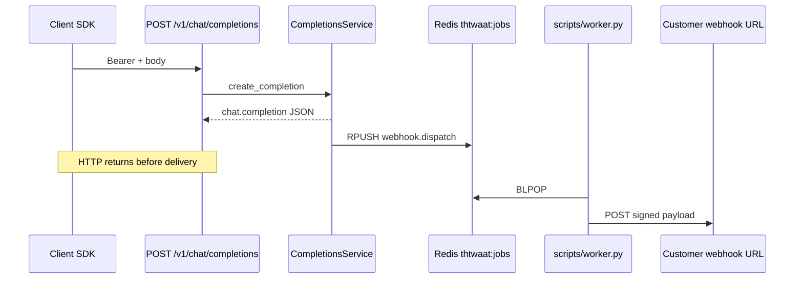

# Semester 02 · Week 3 · Day 1 — Async edge architecture + job contract

**Status:** Implemented in THTWAAT core (`app/openai_compat/notify.py` + worker `webhook.dispatch`)  
**Tag target (end of Week 3):** `sem02-w3-async-edge`  
**Out of scope today:** SSE streaming, delivery retries beyond dead-letter, webhook_deliveries outbox table (Days 2–5)

---

## Architecture



### Design decisions (ADR-lite)

| Decision | Choice | Why |
|----------|--------|-----|
| Transport | Existing Redis list `thtwaat:jobs` | Already in prod compose; dead-letter exists |
| Job type | `webhook.dispatch` | One job = one HTTP POST to one subscription |
| Emit timing | After persist log (success or upstream fail) | Audit row exists; request path stays fast |
| Cache HIT | **No** webhook | Same as usage skip — avoid notify storms |
| Redis down | Fail-open (log + continue) | Completions must not 503 because webhooks are soft |
| Signing | Reuse `WebhookService._sign_payload` | HMAC sha256 header already documented |
| Events | `completion.succeeded`, `completion.failed` | Sem 02 non-negotiable names |

### Folder map

```text
app/openai_compat/
  events.py      # event names + payload builders
  notify.py      # enqueue helpers (Day 1)
  service.py     # hooks after persist
scripts/worker.py          # handles webhook.dispatch
docs/course/.../week-03/day-01.md
tests/unit/openai_compat/test_notify.py
```

---

## Job contract

```json
{
  "type": "webhook.dispatch",
  "company_id": "uuid",
  "webhook_id": "uuid",
  "url": "https://customer.example/hooks/thtwaat",
  "secret": "whsec_...",
  "event": "completion.succeeded",
  "data": {
    "completion_id": "chatcmpl_...",
    "model": "thtwaat-stub-mini",
    "status": "succeeded",
    "usage": {"prompt_tokens": 3, "completion_tokens": 8, "total_tokens": 11},
    "latency_ms": 12,
    "error": null
  },
  "enqueued_at": "2026-08-03T04:00:00+00:00"
}
```

Customer HTTP body:

```json
{
  "event": "completion.succeeded",
  "data": { "...": "same as job.data" }
}
```

Header: `X-THTWAAT-Signature: sha256=<hex>`

---

## Lab checklist (Day 1)

- [x] Document architecture + ADR
- [x] `enqueue_completion_webhooks` fans out one job per matching subscription
- [x] Worker delivers via signed POST
- [x] CompletionsService emits on success / upstream failure (not cache HIT)
- [x] Unit tests for payload + enqueue filtering
- [ ] Manual: register webhook with `completion.succeeded`, call `/v1/chat/completions`, watch worker logs

---

## Tomorrow (Day 2)

Retry policy, backoff, and whether we need a `webhook_deliveries` table vs Redis-only dead-letter.

**Stop here — await approval before Day 2.**
