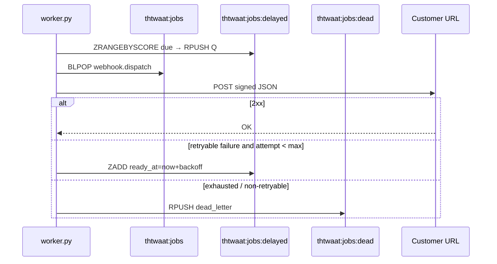

# Semester 02 · Week 3 · Day 2 — Webhook delivery retries

**Status:** Implemented (`app/webhooks/delivery.py` + worker delayed queue)  
**Depends on:** Day 1 (`webhook.dispatch` job contract)  
**Out of scope today:** SSE streaming (Day 3), HMAC replay defense deep-dive (Day 5), outbox table

---

## Architecture



### Design decisions (ADR-lite)

| Decision | Choice | Why |
|----------|--------|-----|
| Delay store | Redis ZSET `thtwaat:jobs:delayed` | Score = ready unix time; no Celery |
| Backoff | `base^attempt` capped (default 2^n, cap 300s) | Simple, ops-visible |
| Max attempts | `WEBHOOK_MAX_ATTEMPTS=5` | Enough for blips; avoid infinite loops |
| Retryable | 5xx, 408, 429, network/timeout | 4xx → fewer retries then dead |
| Delivery API | `deliver_webhook` raises `WebhookDeliveryError` | Worker can branch; legacy BackgroundTasks still soft-log |
| Usage metering | Unchanged (sync on request) | Webhook at-least-once ≠ billing |

### Settings

```text
WEBHOOK_MAX_ATTEMPTS=5
WEBHOOK_BACKOFF_BASE_SECONDS=2
WEBHOOK_BACKOFF_CAP_SECONDS=300
```

### Folder map

```text
app/webhooks/delivery.py       # sign + POST + backoff helper
app/monitoring/queue.py        # delayed ZSET + promote + dead_letter
scripts/worker.py              # promote → process → retry/dead
tests/unit/openai_compat/test_webhook_delivery.py
docs/course/.../week-03/day-02.md
```

---

## Lab checklist (Day 2)

- [x] `deliver_webhook` raises on non-2xx / network errors
- [x] Worker schedules delayed retries with attempt++
- [x] Exhausted attempts → dead letter with reason
- [x] `queue_stats` reports `delayed_depth`
- [x] Unit tests for backoff + retry/dead paths
- [ ] Manual: point webhook at `https://httpstat.us/503`, complete a chat, watch retries then dead

---

## Tomorrow (Day 3)

SSE streaming for `POST /v1/chat/completions` (`stream=true`).

**Stop here — await approval before Day 3.**
