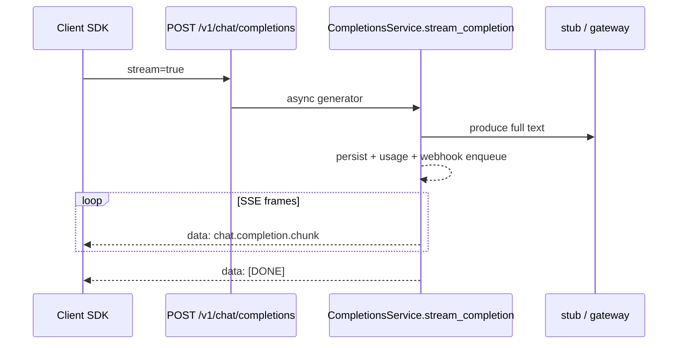

# Semester 02 · Week 3 · Day 3 — SSE streaming

**Status:** Implemented (`app/openai_compat/streaming.py` + router `StreamingResponse`)  
**Depends on:** Days 1–2 (webhooks enqueue after persist)  
**Out of scope today:** Idempotency-Key + stream (Day 4), true token streaming from providers

---

## Architecture



### Design decisions (ADR-lite)

| Decision | Choice | Why |
|----------|--------|-----|
| Wire format | OpenAI `chat.completion.chunk` + `data: [DONE]` | SDK drop-in |
| Stub stream | Split finished stub text into pieces | Deterministic CI; no fake tokenizers |
| Gateway stream | Generate full reply then piece-stream | Gateway has no native SSE yet |
| Persist timing | **Before** SSE frames | Usage/webhooks reliable even if client disconnects mid-stream |
| Idempotency + stream | **400** `idempotency_stream_unsupported` | Day 4 designs partial-response rules |
| Cache | Always `X-Cache: BYPASS` on stream | Never cache partial/streamed bodies |
| Rate limit | Enforced before stream starts | Same RPM/RPD as JSON path |

### Example

```http
POST /v1/chat/completions
Authorization: Bearer tht_key_...
Content-Type: application/json

{"model":"thtwaat-stub-mini","messages":[{"role":"user","content":"Hi"}],"stream":true}
```

```text
data: {"id":"chatcmpl_...","object":"chat.completion.chunk","choices":[{"delta":{"role":"assistant","content":""},...}]}

data: {"id":"chatcmpl_...","choices":[{"delta":{"content":"[thtwaat-stub:..."},...}]}

data: {"id":"chatcmpl_...","choices":[{"delta":{},"finish_reason":"stop"}],"usage":{...}}

data: [DONE]
```

---

## Lab checklist (Day 3)

- [x] `stream=true` → `text/event-stream`
- [x] Chunk schema + `[DONE]`
- [x] Stub + gateway piece streaming
- [x] Persist / usage / webhooks still fire
- [x] Idempotency-Key + stream → 400
- [x] Unit tests for SSE helpers + stream_completion
- [ ] Manual: `curl -N` against local `/v1/chat/completions`

---

## Tomorrow (Day 4)

Streaming × idempotency debugging + failure injection.

**Stop here — await approval before Day 4.**
