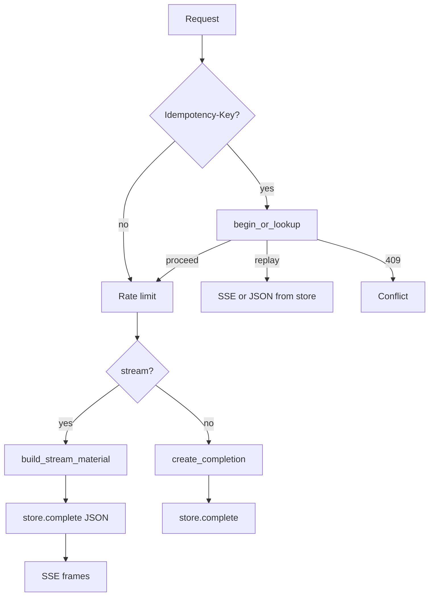

# Semester 02 · Week 3 · Day 4 — Streaming × idempotency (debug day)

**Status:** Implemented in router + `StreamMaterial`  
**Depends on:** Day 3 SSE  
**Out of scope today:** True partial-token provider streams, webhook dedupe keys

---

## Rules (memorize)

| Case | Behavior |
|------|----------|
| `stream=true` + new `Idempotency-Key` | Claim → build material (persist/usage/webhook) → **store full JSON** → SSE |
| Same key + same body (incl. `stream`) | **Replay** SSE from stored JSON (`Idempotent-Replayed: true`) — **no** new usage |
| Same key + different body / `stream` flag | **409** `idempotency_key_reuse` |
| Same key while first still `in_progress` | **409** `idempotency_in_progress` |
| Upstream fail before store | **abandon** key so client can retry |
| Replay | Skips rate-limit consume |



### Why store JSON even for streams?

Partial SSE cannot be safely replayed. We only mark the key **completed** after the full assistant text exists, then re-chunk on replay. Clients may see SSE twice with identical content — that is at-least-once delivery; usage meters once.

---

## Debug matrix (lab)

| Inject | Expect |
|--------|--------|
| Two parallel stream requests, same key | One proceeds; other **409 in_progress** |
| Retry after success, same key | Replay SSE; `Idempotent-Replayed: true` |
| Retry with `stream=false` same key | **409 reuse** (hash includes stream) |
| Kill Redis mid-flight | Soft-fail: request may proceed without lock (logged) |
| Gateway 502 during build | Key abandoned; retry allowed |

---

## Folder map

```text
app/openai_compat/streaming.py   # StreamMaterial, material_from_stored_response
app/openai_compat/service.py     # build_stream_material
app/openai_compat/router.py      # unified idempotency for JSON + SSE
docs/.../week-03/day-04.md
tests/unit/openai_compat/test_stream_idempotency.py
```

---

## Lab checklist (Day 4)

- [x] Remove Day 3 `idempotency_stream_unsupported` block
- [x] Store completed JSON before first SSE byte
- [x] Replay re-streams without re-metering
- [x] Failures before store abandon the key
- [x] Unit tests for material replay + hash includes stream
- [ ] Manual parallel curl with same Idempotency-Key

---

## Tomorrow (Day 5)

HMAC security drill + interview questions for webhook delivery.

**Stop here — await approval before Day 5.**
