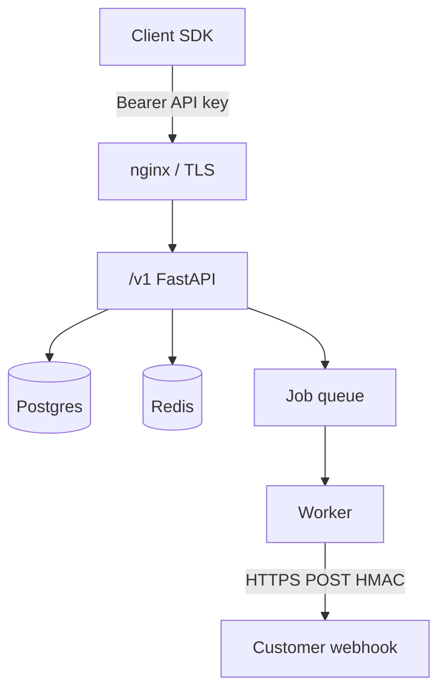

# Sem02 Gateway Threat Model — OpenAI-compatible `/v1`

**Date:** 2026-08-03  
**Scope:** THTWAAT core API as Sem02 gateway (`/v1/models`, `/v1/chat/completions`, webhooks, usage)  
**Milestone:** `sem02-w4-gateway-ship`  
**Companion:** product [`docs/release/v1.0.0/SECURITY_REVIEW.md`](../../../../release/v1.0.0/SECURITY_REVIEW.md)

---

## Assets

| Asset | Sensitivity |
|-------|-------------|
| Tenant API keys (`tht_live_*` / `tht_key_*`) | Critical — authn |
| Completion prompts / responses | High — customer data |
| Usage / spend meters | High — billing integrity |
| Webhook secrets (`whsec_*`) | High — forge events |
| Redis idempotency / rate-limit state | Medium — abuse / dedupe |
| Outbox `webhook_deliveries` | Medium — delivery audit |

---

## Trust boundaries

- Client never supplies `company_id` as authority — derived from key only.  
- Worker is trusted for outbound HTTP; customer URL is **untrusted**.

---

## STRIDE (gateway-focused)

| Threat | Example | Mitigation | Residual |
|--------|---------|------------|----------|
| **S**poofing | Stolen API key | Bearer keys hashed at rest; rotate/revoke in control plane | Key leak via client logs |
| **T**ampering | Forged webhook body | HMAC `v1` over `{t}.{body}` | Weak customer secret storage |
| **R**epudiation | Denied completion | `openai_completion_logs` + `request_id` | Client-side clock skew |
| **I**nfo disclosure | Cross-tenant model/completion | Service-layer `company_id` filters + IDOR tests | Misconfigured admin routes |
| **D**oS | RPM flood | Redis rate limits; fail-**open** if Redis down | Abuse window during Redis outage |
| **E**levation | Webhook → hit cloud metadata | SSRF guard on URL create + deliver (Day 5) | DNS rebinding race (TTL) |

---

## Abuse cases (must-pass interviews)

1. **IDOR** on another tenant’s private model / completion log → deny.  
2. **Replay** captured webhook → timestamp outside tolerance → reject.  
3. **SSRF** `https://169.254.169.254/` as webhook URL → 400 / non-retryable dead.  
4. **Idempotency race** → one proceed, others 409 in_progress.  
5. **SSE disconnect** → still billed (documented partner contract).

---

## Controls checklist (Sem02 `/v1`)

- [x] Auth required on `/v1/*` (401 without key)  
- [x] Tenant from key, not body  
- [x] Idempotency + rate limit (fail-open on Redis errors — documented Day 4)  
- [x] Webhook HMAC v1 + `delivery_id`  
- [x] Durable outbox + redrive  
- [x] Webhook URL SSRF guard  
- [ ] mTLS to customer endpoints (deferred)  
- [ ] Fail-closed rate limits under Redis outage (product decision)

---

## Verdict for ship gate

**Ready for Day 6 harden** if SSRF tests pass and VPS CORS/metrics ops items from product SECURITY_REVIEW remain tracked as ops gates (not Sem02 code blockers).
