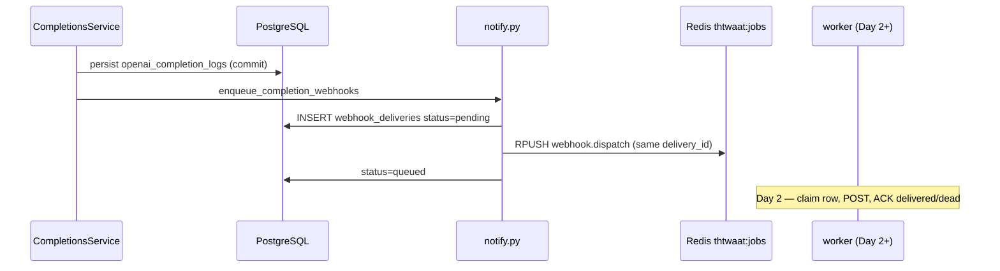

# Semester 02 · Week 4 · Day 1 — Ship architecture + webhook outbox contract

**Status:** Implemented (`webhook_deliveries` + dual-write from notify)  
**Tag target (end of Week 4):** `sem02-w4-gateway-ship` → `sem02-v1.0.0`  
**Out of scope today:** Worker claim/ACK/redrive (Day 2), k6 (Day 3), full threat model (Day 5)

---

## Why Week 4 exists

Weeks 1–3 shipped the OpenAI-compatible data plane in **THTWAAT core**.
Week 4 hardens it to a **ship gate**: durable async edges, load/concurrency evidence,
threat model, and tags.

### Gap focus (from W3 REVIEW / RETRO)

| Gap | Day 1 action |
|-----|----------------|
| Redis-only webhook jobs | Introduce Postgres `webhook_deliveries` outbox |
| No Sem02 gateway threat model | Outline only (Day 5 fills) |
| No `/v1` k6 | Deferred Day 3 |
| SSE disconnect still billed | Partner note deferred Day 4 |

---

## Architecture



### Design decisions (ADR-lite)

| Decision | Choice | Why |
|----------|--------|-----|
| Where is the gateway? | Keep in `thtwaat-core-api` `/v1` | Already on VPS; Sem02 ship ≠ repo split |
| Outbox vs Kafka | Postgres table + existing Redis list | Matches W3 spine; no new broker |
| Dual-write order | DB pending → Redis → mark queued | Redis loss leaves recoverable rows |
| Same TX as completion log? | **Not Day 1** | Persist already commits; note as Day 2 polish |
| Store webhook secret in outbox? | **No** | Re-read from `webhooks` on redrive |
| Fail-open | Outbox or Redis errors log; never 503 completions | Soft edge stays soft |

### Folder map

```text
app/webhooks/
  model.py          # Webhook + WebhookDelivery
  outbox.py         # record_pending / mark_queued (Day 1)
  delivery.py       # HTTP + HMAC (unchanged)
app/openai_compat/notify.py   # dual-write
alembic/versions/g1a2b3c4d5e6_webhook_deliveries_outbox.py
docs/course/.../week-04/day-01.md
tests/unit/openai_compat/test_webhook_outbox.py
```

---

## Outbox row contract

| Column | Meaning |
|--------|---------|
| `delivery_id` | Stable `whdel_…` (customer dedupe key) |
| `company_id` / `webhook_id` | Tenant + subscription |
| `event` | e.g. `completion.succeeded` |
| `url` | Snapshot at enqueue time |
| `payload` | JSON body fields (`event`, `data`, `delivery_id`, …) |
| `status` | `pending` → `queued` (Day 1); later `delivered` / `dead` |
| `attempts` / `last_error` / `next_attempt_at` | Reserved for Day 2 worker |

Redis job still carries `secret` for the live path; outbox does **not**.

---

## Lab checklist (Day 1)

- [x] Week 4 README + architecture ADR
- [x] `webhook_deliveries` ORM + Alembic
- [x] Dual-write from `enqueue_webhook_dispatch`
- [x] Unit tests for outbox record + notify path
- [ ] Apply migration on VPS (`alembic upgrade head`) — ops
- [ ] Worker ACK/redrive — **Day 2**

---

## Tomorrow (Day 2)

Worker updates outbox on success/failure; pending/queued sweeper redrives stuck rows.

**Stop here — await approval before Day 2.**
