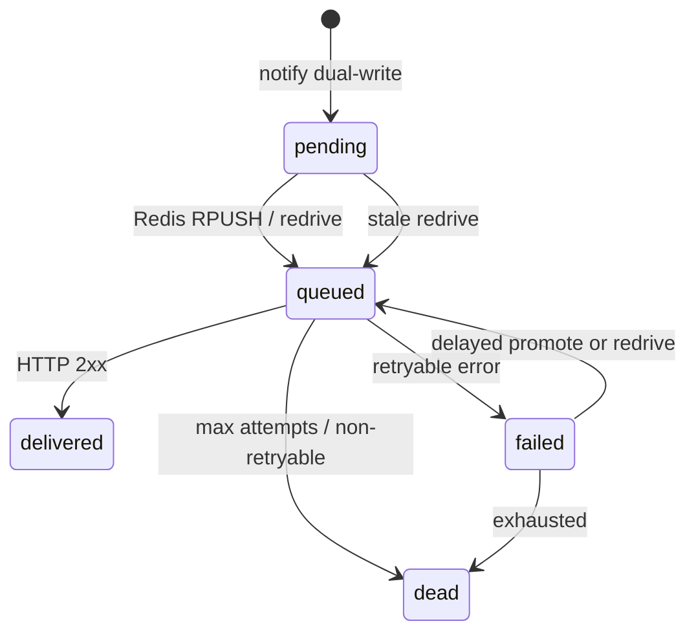

# Semester 02 · Week 4 · Day 2 — Outbox claim / ACK / redrive

**Status:** Implemented (worker ACK + stuck-row redrive)  
**Depends on:** Day 1 `webhook_deliveries`  
**Out of scope today:** k6 / concurrency smoke (Day 3), threat model (Day 5)

---

## Architecture

### Worker loop (Day 2)

1. `promote_due_jobs` (Redis delayed → list)  
2. `redrive_stuck_deliveries` (Postgres outbox → Redis)  
3. `BLPOP webhook.dispatch` → ACK attempt → HTTP → ACK delivered **or** failure handler → ACK failed/dead  

### Redrive rules

| Status | Condition | Action |
|--------|-----------|--------|
| `pending` | `created_at` older than `WEBHOOK_OUTBOX_STALE_SECONDS` | Rebuild job; secret from `webhooks` |
| `queued` | `updated_at` stale (likely lost after BLPOP) | Replay **same** attempt |
| `failed` | `next_attempt_at` due + stale | Increment attempt; enqueue |

Secrets are **never** stored on the outbox row.

### Settings

| Key | Default |
|-----|---------|
| `WEBHOOK_OUTBOX_ENABLED` | `true` |
| `WEBHOOK_OUTBOX_STALE_SECONDS` | `120` |
| `WEBHOOK_OUTBOX_REDRIVE_BATCH` | `50` |

---

## Lab checklist (Day 2)

- [x] `mark_delivery_*` + `ack_from_job_payload`
- [x] Worker success / retry / dead ACK
- [x] `redrive_stuck_deliveries` in worker loop
- [x] Unit tests
- [ ] VPS: rebuild worker; watch `outbox_redrive` / `webhook_delivered` logs

---

## Tomorrow (Day 3)

Concurrency smoke + gateway-focused k6 for `/v1/chat/completions` (JSON + SSE).

**Stop here — await approval before Day 3.**
