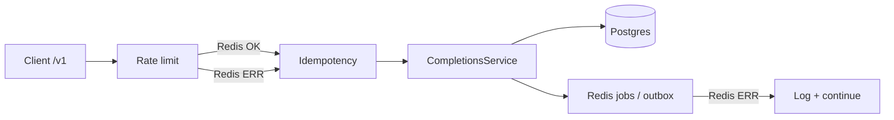

# Semester 02 · Week 4 · Day 4 — Redis fail modes + SSE partner notes

**Status:** Implemented (docs + pinned fail-open tests)  
**Depends on:** Days 1–3  
**Out of scope today:** Full threat model (Day 5), fail-**closed** rate limits (product decision later)

---

## Redis control-plane matrix

Gateway `/v1` uses Redis for cache, idempotency, and rate limits.
When Redis is down or errors, we prefer **fail-open** so completions stay available.
Abuse controls degrade; availability does not.

| Subsystem | Redis healthy | Redis down / error | Client sees |
|-----------|---------------|--------------------|-------------|
| Model / response **cache** | HIT/MISS headers | Treat as MISS; no write | Slightly higher latency; still 200 |
| **Idempotency-Key** | Claim / replay / 409 | Proceed **without** lock (logged) | Possible duplicate work if client retries blindly |
| **Rate limit** | 429 + `Retry-After` | Allow request (logged) | Noisy-neighbor risk until Redis returns |
| **Webhook enqueue** | RPUSH job | Soft-fail; completion still 200 | Outbox row may stay `pending` → Day 2 redrive |
| **Outbox redrive** | Worker loop | Log + skip cycle | Rows wait for next healthy cycle |

### Interview answer (memorize)

> Cache and idempotency are **optimizations / correctness aids**, not the source of truth.
> Completions and usage live in Postgres. Redis failure must not take down the data plane;
> it may temporarily weaken dedupe and RPM enforcement.

---

## Partner note — SSE disconnect & billing

**File:** [`docs/partners/openai-compat-sse.md`](../../../../partners/openai-compat-sse.md)

Key rules for integrators:

1. We **materialize** the full completion (persist + usage + webhook enqueue) **before** SSE frames.
2. If the client **disconnects mid-stream**, the completion is still **billed** and webhooks may still fire.
3. Use `Idempotency-Key` for safe retries; replays do **not** double-meter.
4. Webhook receivers must dedupe on `delivery_id` (`whdel_…`) — delivery is at-least-once.

---

## Debug lab (manual)

| Inject | Expect |
|--------|--------|
| Stop Redis; `POST /v1/chat/completions` | 200 stub/gateway (not 503) |
| Same + `Idempotency-Key` twice quickly | Both may proceed (no lock) — logged |
| Restore Redis; same key after complete | Replay / 409 per normal rules |
| Kill client mid-SSE | Row in `openai_completion_logs` + usage already written |

---

## Lab checklist (Day 4)

- [x] Fail-mode matrix documented
- [x] Partner SSE billing note
- [x] Unit tests pin cache / rate-limit / idempotency fail-open
- [ ] Manual Redis-down probe on VPS (ops)

---

## Tomorrow (Day 5)

Sem02 gateway threat model + interview drill.

**Stop here — await approval before Day 5.**
