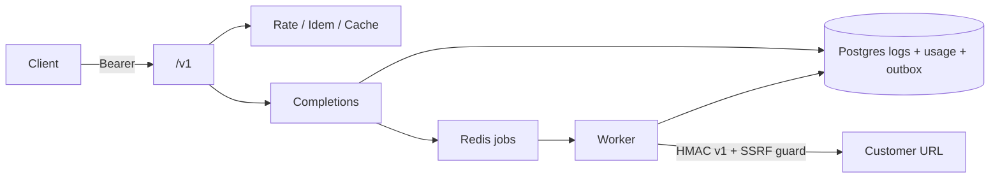

# Semester 02 · Week 4 · Day 6 — Milestone harden

**Status:** Implemented (ship checklist + W4 gate tests + smoke)  
**Depends on:** Days 1–5  
**Tomorrow:** Day 7 REVIEW + tags `sem02-w4-gateway-ship` and `sem02-v1.0.0`

---

## Definition of Done

See [SHIP_CHECKLIST.md](./SHIP_CHECKLIST.md). Day 6 closes **code** evidence; Day 7 is formal review + git tags.

### Architecture freeze (Week 4)



---

## Gate tests

`tests/unit/openai_compat/test_week4_gate.py`

- Auth still required on completions  
- Outbox helpers importable / status constants  
- SSRF rejects loopback  
- ORM bootstrap idempotent  
- Redis fail-open rate limit path  
- Threat / ship docs present  

```bash
python -m pytest tests/unit/openai_compat/test_week4_gate.py -q
python -m pytest tests/unit/openai_compat/ -q
```

---

## Smoke

```bash
export API_BASE=http://127.0.0.1:8000
export API_KEY=tht_live_...
bash scripts/smoke_w4_openai_compat.sh
```

Wraps W3 smoke and prints W4 checklist reminders (outbox table, SSRF, worker health).

---

## Lab checklist (Day 6)

- [x] SHIP_CHECKLIST.md  
- [x] Week 4 gate unit tests  
- [x] `scripts/smoke_w4_openai_compat.sh`  
- [ ] Run smoke / gate against staging or VPS (ops)  

---

## Tomorrow (Day 7)

REVIEW.md + RETRO.md + annotated tags:

- `sem02-w4-gateway-ship`  
- `sem02-v1.0.0` (Sem02 final ship)

**Stop here — await approval before Day 7.**
