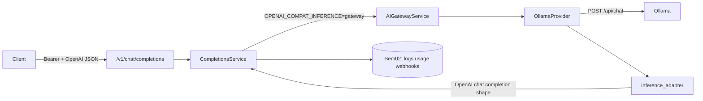

# Semester 03 · Week 1 · Day 1 — Inference architecture + adapter contract

**Status:** Implemented (`app/openai_compat/inference_adapter.py` + Ollama soft probe)  
**Tag target (end of Week 1):** `sem03-w1-ollama-openai`  
**Out of scope today:** Ollama SSE token stream, catalog sync, vLLM (Days 2–4 / later weeks)

---

## Architecture



### Design decisions (ADR-lite)

| Decision | Choice | Why |
|----------|--------|-----|
| Where does inference live? | Core API adapter + existing provider | Sem02 already rejected a premature gateway split |
| Day 1 ship | Pure map functions + unit tests | Same “contract first” pattern as W3 `notify` |
| `/ready` vs Ollama | **Do not** gate readiness on Ollama | Daemon may be cold-pulling models; keep K8s/compose ready on DB/Redis |
| `/health` | Soft `ollama_live` probe | Observability without failing the whole health if Ollama is down |
| OpenAI ids | `chatcmpl_…` minted by adapter when mapping | Matches Sem02 completions plane |

### Folder map

```text
app/openai_compat/inference_adapter.py   # Day 1 contract
app/deploy/health.py                     # ollama_live soft probe
docs/course/.../semester-03/week-01/day-01.md
tests/unit/openai_compat/test_inference_adapter.py
```

---

## Adapter contract (Day 1)

### Ollama `/api/chat` (non-stream) → OpenAI `chat.completion`

| Ollama field | OpenAI field |
|--------------|--------------|
| `message.content` | `choices[0].message.content` |
| `prompt_eval_count` | `usage.prompt_tokens` |
| `eval_count` | `usage.completion_tokens` |
| `done_reason` | `finish_reason` (mapped) |
| (request) `model` | `model` |

### Probe

`GET {OLLAMA_URL}/api/tags` → `{ok, latency_ms, models_count?}` — used by `/health` only.

---

## Lab checklist (Day 1)

- [x] Sem03 syllabus + Week 1 README  
- [x] Adapter module + unit tests  
- [x] Soft Ollama probe on `/health`  
- [ ] Manual: `curl $OLLAMA_URL/api/tags` on VPS  

---

## Tomorrow (Day 2)

Wire adapter into gateway/`CompletionsService` DX (`provider=ollama` defaults) and document env for local inference.

**Stop here — await approval before Day 2.**
