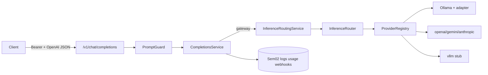

# Semester 03 · Week 1 · Day 6 — Milestone build

**Status:** Implemented (ship checklist + Sem03 W1 gate tests + smoke)  
**Depends on:** Days 1–5  
**Tomorrow:** Day 7 REVIEW + annotated tag `sem03-w1-ollama-openai`  
**Out of scope today:** Git tag ceremony (Day 7), Week 2 streaming

---

## Definition of Done

See [SHIP_CHECKLIST.md](./SHIP_CHECKLIST.md). Day 6 closes **code** evidence; Day 7 is formal review + git tag.

### Architecture freeze (Week 1)



---

## Gate tests

`tests/unit/openai_compat/test_sem03_w1_gate.py`

- Adapter contract exports  
- Registry core providers  
- Router policy set  
- Error taxonomy (504 timeout / 404 model)  
- Prompt guard injection block  
- Sem03 settings present  
- Auth still required on completions  
- Week 1 docs + smoke script present  

```bash
python -m pytest tests/unit/openai_compat/test_sem03_w1_gate.py -q
python -m pytest tests/unit/openai_compat/test_inference_adapter.py tests/unit/openai_compat/test_provider_registry.py tests/unit/openai_compat/test_inference_router.py tests/unit/openai_compat/test_inference_errors.py tests/unit/openai_compat/test_prompt_guard.py -q
```

---

## Smoke

```bash
export API_BASE=http://127.0.0.1:8000
export API_KEY=tht_live_...
bash scripts/smoke_sem03_w1_inference.sh
```

Checks `/live`, `/ready`, `/health`, models auth, prompt-guard 400, benign stub completion.

---

## Lab checklist (Day 6)

- [x] SHIP_CHECKLIST.md  
- [x] `test_sem03_w1_gate.py`  
- [x] `scripts/smoke_sem03_w1_inference.sh`  
- [ ] Run gate + smoke against local/VPS (ops)  

---

## Tomorrow (Day 7)

REVIEW + RETRO + tag `sem03-w1-ollama-openai` — see [day-07.md](./day-07.md).

**Day 6 complete.**
