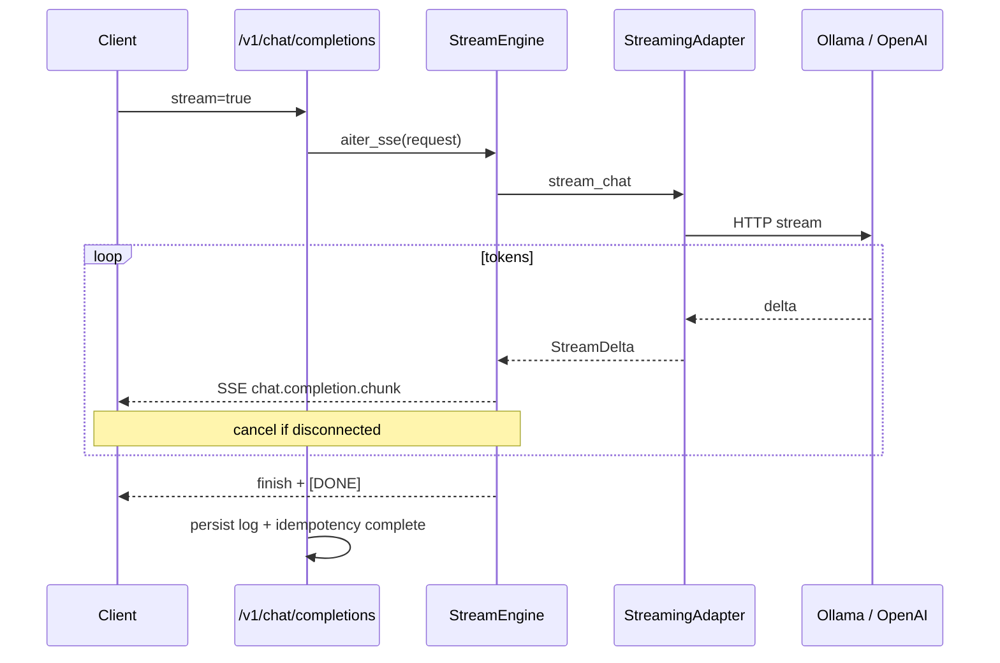

# Semester 03 · Week 2 · Day 1 — Production streaming engine (OpenAI-compatible)

**Status:** Implemented  
**Depends on:** Week 1 `sem03-w1-ollama-openai`  
**Out of scope today:** Voice, images, parallel streams, retries, billing features

---

## Goal

True incremental SSE for `POST /v1/chat/completions` with `stream=true` — tokens leave the provider as they are generated (not Sem02 materialize-then-slice).

---

## Architecture



| Piece | Path |
|-------|------|
| Interface | `providers/streaming_adapter.py` |
| Engine | `stream_engine.py` |
| Ollama NDJSON | `providers/ollama_stream.py` |
| OpenAI SSE | `providers/openai_stream.py` (+ synthetic fallback) |
| Metrics | `providers/stream_metrics.py` |
| Factory | `providers/stream_factory.py` |
| Router | gateway + `STREAM_ENABLED` → true stream; stub keeps Sem02 materialize path |

### Behavior

| Mode | Behavior |
|------|----------|
| `STREAM_ENABLED=false` | `stream=true` → **400** `stream_disabled` |
| `OPENAI_COMPAT_INFERENCE=stub` | Sem02 materialize-then-SSE (CI) |
| `gateway` + stream | True adapter stream (ollama / openai) |
| Client disconnect | `adapter.cancel()` — stop upstream; abandon idempotency key |
| Empty stream | role + finish + `[DONE]` |
| Timeout / upstream fail before bytes | OpenAI-shaped **504** / **502** |

### Metrics

- `first_token_latency_ms`
- `total_stream_duration_ms`
- `streamed_tokens`

### Env

```text
STREAM_ENABLED=true
INFERENCE_STREAM_LIVE_OPENAI=true   # false → synthetic openai pieces (CI)
```

---

## Lab checklist (Day 1)

- [x] SSE `stream=true`  
- [x] Common StreamingAdapter  
- [x] Ollama + OpenAI adapters  
- [x] Cancel on disconnect  
- [x] Stream metrics  
- [x] Unit tests (success / disconnect / empty / failure / timeout)  
- [ ] Manual: gateway + Ollama `stream=true` curl  

---

## Tomorrow (Day 2)

Production streaming reliability — routing, fallback, timeouts, backpressure.

See [day-02.md](./day-02.md).
