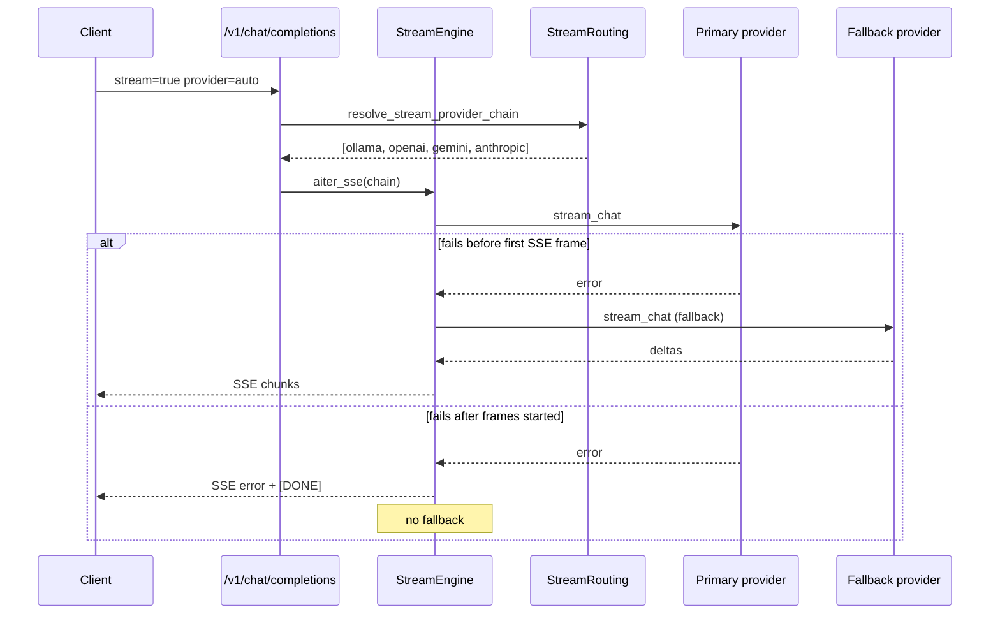

# Semester 03 · Week 2 · Day 2 — Production Streaming Reliability

**Status:** Implemented  
**Depends on:** Week 2 Day 1 true SSE engine  
**Out of scope:** Voice, images, billing, parallel providers, multi-region

---

## Goal

Make the OpenAI-compatible streaming engine production-ready: routing policies, pre-token fallback, timeouts, backpressure, metrics, and structured logs.

---

## Architecture



| Piece | Path |
|-------|------|
| Routing | `stream_routing.py` |
| Engine | `stream_engine.py` |
| Adapters | `ollama_stream`, `openai_stream`, `gemini_stream` (+ anthropic) |
| Factory | `providers/stream_factory.py` |
| Metrics | `providers/stream_metrics.py` |

---

## 1. Provider routing

Request field `provider` (THTWAAT extension):

| Value | Behavior |
|-------|----------|
| `auto` (default) | InferenceRouter primary when possible, then `STREAM_FALLBACK_ORDER` |
| `ollama` / `openai` / `gemini` / `anthropic` | That provider first, then remaining fallbacks |

```text
STREAM_DEFAULT_PROVIDER=auto
STREAM_FALLBACK_ORDER=ollama,openai,gemini,anthropic
```

---

## 2. Automatic fallback

- If the selected provider fails **before any SSE frame** is sent → try next in chain.
- If failure occurs **after** streaming has started → emit SSE error + `[DONE]`; **do not** switch providers.

---

## 3. Streaming timeouts

| Setting | Default | Meaning |
|---------|---------|---------|
| `STREAM_CONNECT_TIMEOUT` | `10` | Open upstream / first adapter await |
| `STREAM_FIRST_TOKEN_TIMEOUT` | `30` | Wait for first content token |
| `STREAM_IDLE_TIMEOUT` | `60` | Max gap between subsequent deltas |

Timeouts map to OpenAI-shaped **504** (`ProviderTimeoutError`) when nothing has been streamed yet.

---

## 4. Backpressure

| Setting | Default |
|---------|---------|
| `STREAM_MAX_QUEUED_EVENTS` | `256` |

Internal asyncio queue bounds producer speed. Slow / disconnected clients cancel upstream safely (`stream_cancelled`).

---

## 5. Metrics

`get_streaming_metrics().snapshot()` includes:

- `stream_started` / `stream_completed` / `stream_cancelled` / `stream_failed`
- `fallback_used`
- `provider_latency_ms`
- `tokens_streamed` (+ Day 1 first-token / duration fields)

---

## 6. Structured logs

Per completed / failed / cancelled stream:

```text
openai_compat.stream request_id=… tenant_id=… provider=… model=…
  stream_duration_ms=… completion_tokens=… finish_reason=… outcome=…
```

Router passes `tenant_id=company_id` and optional `request_id`.

---

## Lab checklist (Day 2)

- [x] provider=auto \| ollama \| openai \| gemini \| anthropic  
- [x] Fallback before first token only  
- [x] Connect / first-token / idle timeouts  
- [x] Queued-event backpressure  
- [x] Metrics counters  
- [x] Structured logs  
- [x] Unit tests (`test_stream_reliability.py`)  
- [ ] Manual: gateway curl with `provider=auto` and forced primary failure  

---

## Tomorrow (Day 3)

Locked until approved.

**Stop here — Day 2 complete.**
