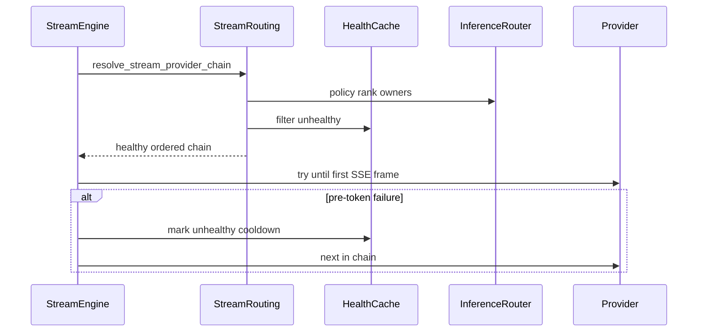

# Semester 03 · Week 2 · Day 3 — Health-aware Provider Fallback & Intelligent Routing

**Status:** Implemented  
**Depends on:** Day 2 streaming reliability + Week 1 InferenceRouter / health cache  
**Out of scope today:** Circuit breaker product, parallel fan-out, multi-region, voice/images/billing

---

## What shipped

| Piece | Path |
|-------|------|
| Health-aware stream chain | `app/openai_compat/stream_routing.py` |
| Pre-token health updates | `app/openai_compat/stream_engine.py` |
| Shared TTL health cache | `app/openai_compat/providers/health_cache.py` (W1) |
| Stream metrics | `app/openai_compat/providers/stream_metrics.py` |
| Tests | `tests/unit/openai_compat/test_stream_health_routing.py` |

### Behavior

1. **`provider=auto`** — Build stream pool (model owners ∩ stream providers, else `STREAM_FALLBACK_ORDER`), rank with `INFERENCE_ROUTING_POLICY` (`default` / `cheapest` / `fastest` / `highest_quality` / `preferred_provider`), then **drop unhealthy** providers via `InferenceRouter.is_healthy` + shared cache.
2. **`provider=<name>`** — Forced provider stays **first even if unhealthy** (explicit override). Remaining fallbacks are health-filtered.
3. **Empty healthy set (auto)** → OpenAI-shaped **503** `no_healthy_provider`.
4. **Pre-token failure** → `health_cache.put(provider, {ok: False})` for `INFERENCE_HEALTH_CACHE_TTL_SECONDS` (cooldown). Next resolve skips that provider.
5. **Successful stream** → refresh `{ok: True}` for the winning provider.
6. **Fallback still only before first SSE frame** (Day 2 contract unchanged).



### Env (reuse W1 / W2 — no new circuit-breaker knobs)

```text
INFERENCE_ROUTING_POLICY=default
INFERENCE_DEFAULT_PROVIDER=ollama
INFERENCE_HEALTH_CACHE_TTL_SECONDS=30
STREAM_DEFAULT_PROVIDER=auto
STREAM_FALLBACK_ORDER=ollama,openai,gemini,anthropic
```

### Metrics

`get_streaming_metrics().snapshot()` adds:

- `health_skipped` — providers omitted from the chain as unhealthy
- `stream_providers_unhealthy` — pre-token failures that marked the cache

Day 2 counters (`fallback_used`, started/completed/cancelled/failed, latency, tokens) unchanged.

---

## Lab checklist (Day 3)

- [x] Health-filter stream provider chain  
- [x] Skip unhealthy before first token attempt  
- [x] Intelligent routing policies on `provider=auto`  
- [x] Provider health cache TTL cooldown  
- [x] Fallback before first token only (no mid-stream switch)  
- [x] OpenAI-compatible API unchanged  
- [x] Unit tests (`test_stream_health_routing.py`)  
- [x] Docs (`day-03.md` + week README)  
- [ ] Manual: mark ollama unhealthy in cache / kill Ollama and confirm auto skips to next healthy provider  

---

## Tomorrow (Day 4)

Locked until approved.

**Stop here — Day 3 complete.**
